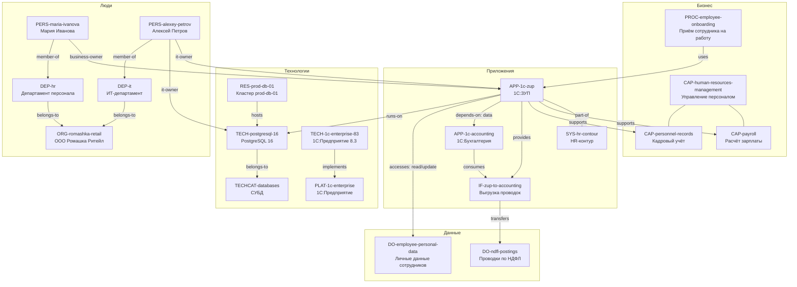

# Как это будет работать: «ИТ Ландшафт» простыми словами

**Статус**: объясняющий документ к дизайн-версии v1.5 (`metamodel-technical-design.md`, ADR-0001…0008). Термины сущностей — EN (канонические ключи), пояснения — RU. Все примеры согласованы с seed-метамодели (15 типов, 20 связей), форматом репозитория ADR-0006/0007 и slug-идентификаторами ADR-0008.

---

## 1. Идея в одном абзаце

«ИТ Ландшафт» — это **единый каталог ИТ-ландшафта компании**: какие у нас есть приложения, системы, технологии, данные, кто ими владеет, как они связаны и что сломается, если что-то выключить. Каталог хранится в **PostgreSQL** (источник истины), редактируется через **веб-интерфейс** и по кнопке выгружается в **GitLab** в виде понятных файлов (YAML + Markdown) — так у каталога появляется история, обзор через Pull Request (со временем) и готовый граф для людей и AI-агентов.

---

## 2. Три уровня системы

Уровень можно сравнить с бумажным делопроизводством:

| Уровень | Что это | Аналогия | Кто меняет |
|---|---|---|---|
| **1. Метамодель** | Справочник «что вообще можно описывать»: типы сущностей, поля, типы связей и их правила | Бланки и формы: «заявление состоит из полей ФИО, дата, подпись» | Архитектор, через change sets |
| **2. Данные** | Заполненные элементы ландшафта: конкретные приложения, владельцы, связи между ними | Заполненные бланки в папках | Аналитики, редакторы — через веб-формы |
| **3. Представления** | Как с этим удобно работать: карточки, impact-граф в вебе; YAML + OKF-концепты в GitLab | Ксерокопии и выписки из папок | Генерируются автоматически |

Ключевое свойство: **метамодель — это данные, а не код**. Добавить новое поле или тип = сделать запись в реестре (change set), без программиста и без релиза. Формы, валидация и экспорт в Git подстраиваются автоматически.

---

## 3. Сквозной пример: маленький ИТ-ландшафт

Возьмём среднюю торговую компанию (ООО «Ромашка Ритейл»). Вот её ландшафт, описанный в системе. Диаграмма показывает главные элементы и связи (подписи на стрелках — типы связей):



Полный состав примера (задействованы все 15 типов ядра):

| Элемент | Тип | Зачем в примере |
|---|---|---|
| CAP-human-resources-management «Управление персоналом» (L1) | business_capability | Способность верхнего уровня |
| CAP-payroll «Расчёт зарплаты», CAP-personnel-records «Кадровый учёт» (L2) | business_capability | Дочерние способности (дерево через parent) |
| APP-1c-zup «1С:ЗУП», APP-1c-accounting «1С:Бухгалтерия» | application | Главные герои примера |
| SYS-hr-contour «HR-контур» | system | Группировка приложений |
| IF-zup-to-accounting «Выгрузка проводок ЗУП → Бухгалтерия» | interface | Граница интеграции |
| DO-ndfl-postings «Проводки по НДФЛ», DO-employee-personal-data «Личные данные сотрудников» | data_object | Информационные активы (у DO-employee-personal-data `pii: true`) |
| PROC-employee-onboarding «Приём сотрудника на работу» | process | Бизнес-процесс, который использует ЗУП |
| TECH-postgresql-16 «PostgreSQL 16», TECH-1c-enterprise-83 «1С:Предприятие 8.3» | technology | Конкретные технологии |
| TECHCAT-databases «СУБД» | technology_category | Категория каталога технологий |
| RES-prod-db-01 «Кластер prod-db-01» | resource | Инфраструктура (environment: prod) |
| PLAT-1c-enterprise «1С:Предприятие» | platform | Стратегическая платформа |
| PRV-its-service «ИТС-Сервис» (1С-франчайзи) | provider | Вендор: предлагает TECH-1c-enterprise-83, обеспечивает APP-1c-zup |
| DEP-hr «Департамент персонала», DEP-it «ИТ-департамент» | department | Подразделения компании (иерархия через parent) |
| ORG-romashka-retail «ООО Ромашка Ритейл» | organization | Юрлицо, к которому относятся департаменты |
| PERS-maria-ivanova «Мария Иванова», PERS-alexey-petrov «Алексей Петров» | person | Владельцы: Мария — бизнес-владелец ЗУП, Алексей — ИТ-владелец ЗУП и БД |
| INIT-hr-unification «Переход на единый HR-контур» (2026-H2) | initiative | Дорожная карта (roadmap) на квартал, затрагивающая APP-1c-zup |

Идентификаторы читаются сами: `APP-1c-zup` — приложение «1С:ЗУП», `TECH-postgresql-16` — технология PostgreSQL 16. Префикс кодирует тип, slug — человекочитаемая метка на латинице, уникальная в пределах типа (ADR-0008).

---

## 4. Как выглядит элемент: APP-1c-zup

Каждый элемент — одна запись в БД и один YAML-файл в GitLab. Вот APP-1c-zup целиком (канонический формат ADR-0006):

```yaml
apiVersion: it-landscape/v1
kind: Entity
metadata:
  oid: "0190c0de-0000-7000-8000-000000000001"   # технический UUID v7, неизменяемый
  type: application
  business_id: APP-1c-zup                        # человеческий идентификатор (slug)
  name: "1С:ЗУП"
  parent_id: null
attributes:
  lifecycle_status: active                       # поле из seed-метамодели
  business_criticality: high
  finance:annual_cost: 480000                    # поле-расширение (namespace finance)
relations:
  - oid: "0190c0de-0000-7000-8000-00000000abcd"
    type: rel_app_supports_capability
    target: business_capability/CAP-payroll
    attributes: {}
  - oid: "0190c0de-0000-7000-8000-00000000bbcd"
    type: rel_app_supports_capability
    target: business_capability/CAP-personnel-records
    attributes: {}
  - oid: "0190c0de-0000-7000-8000-00000000ccde"
    type: rel_app_part_of_system
    target: system/SYS-hr-contour
    attributes: {}
  - oid: "0190c0de-0000-7000-8000-00000000ddef"
    type: rel_app_provides_interface
    target: interface/IF-zup-to-accounting
    attributes: {}
  - oid: "0190c0de-0000-7000-8000-00000000efef"
    type: rel_app_depends_on_app
    target: application/APP-1c-accounting
    attributes: {dependency_kind: data}
  - oid: "0190c0de-0000-7000-8000-00000000f0f1"
    type: rel_app_accesses_data
    target: data_object/DO-employee-personal-data
    attributes: {access_type: [read, update]}
  - oid: "0190c0de-0000-7000-8000-00000000f1f2"
    type: rel_app_runs_on_technology
    target: technology/TECH-postgresql-16
    attributes: {environment: prod}
```

Что здесь важно:

| Часть | Значение |
|---|---|
| `oid` | Технический идентификатор (UUID v7), живёт вечно, никогда не переиспользуется |
| `business_id` | Человеческий идентификатор `APP-1c-zup` — по нему ссылаются люди, файлы и ссылки; неизменяем (OQ-2). Имя меняется свободно — slug не обязан следовать за именем |
| `attributes` | Поля, разрешённые метамоделью для типа `application`; ключи с двоеточием (`finance:annual_cost`) — расширения из namespace'ов |
| `relations` | Связи встроены в файл сущности: тип связи + ссылка на цель `[тип/]business_id` + атрибуты связи (например, `dependency_kind: data`) |
| Сортировка | Ключи и связи отсортированы детерминированно → в Git диффы маленькие и review-дружественные |

Дочерние способности строятся через системный parent-child — например, CAP-payroll:

```yaml
metadata:
  type: business_capability
  business_id: CAP-payroll
  name: "Расчёт зарплаты"
  parent_id: business_capability/CAP-human-resources-management   # дерево: child-of
attributes:
  level: L2
```

---

## 5. Связи: разные виды — по таблице, не «на глазок»

Связь — полноценный элемент: у неё есть **тип** (из метамодели, с правилами «откуда → куда» и кратностью), иногда **атрибуты**. Примеры из seed-реестра:

| Вопрос аналитика | Тип связи | Правило | Атрибуты |
|---|---|---|---|
| Что поддерживает приложение? | `rel_app_supports_capability` | application → business_capability, n:m | — |
| На чём оно работает? | `rel_app_runs_on_technology` | application → technology, n:m | `cost_monthly`, `environment` |
| От кого зависит? | `rel_app_depends_on_app` | application → application, n:m | `dependency_kind` (runtime/data/upgrade) |
| Какие данные читает/пишет? | `rel_app_accesses_data` | application → data_object, n:m | `access_type` (create/read/update/delete) |
| Кто бизнес-владелец? | `rel_business_owner` | person/department/organization → элемент, n:m | — |
| Кто ИТ-владелец? | `rel_it_owner` | person/department/organization → элемент, n:m | — |
| Где работает человек? | `rel_person_member_of_department` | person → department, n:m | — |
| К какому юрлицу относится отдел? | `rel_department_of_organization` | department → organization, n:1 | — |

Владение — два отдельных типа связей (а не поле-переключатель) специально: один человек может быть одновременно бизнес- и ИТ-владельцем одной системы, и обе связи тогда валидны. Владельцем может быть не только человек, но и департамент или юрлицо. Будущие роли (например, `security_owner`) добавляются так же — одним change set'ом.

---

## 6. Как это выглядит в GitLab

По кнопке «Синхронизировать с GitLab» система полностью перегенерирует репозиторий из БД (детерминированный полный рендер — расхождений не бывает по построению) и делает один батч-коммит:

```
it-landscape/
├── README.md                        # обзор: версия метамодели, статистика
├── metamodel/
│   ├── version.yaml                 # v1.5 + история применённых change sets
│   ├── namespaces.yaml
│   ├── entity-types/application.yaml
│   └── relation-types/rel_app_supports_capability.yaml
├── change-sets/
│   └── 0009-add-finance-annual-cost.yaml
├── entities/
│   ├── application/
│   │   ├── APP-1c-zup.yaml          # тот самый файл из §4
│   │   └── APP-1c-accounting.yaml
│   └── person/PERS-maria-ivanova.yaml
└── views/                           # ← OKF-бандл (ADR-0007): граф для людей и агентов
    ├── index.md
    ├── application/
    │   ├── index.md                 # таблица всех приложений
    │   └── APP-1c-zup.md            # OKF-концепт — см. ниже
    └── person/
        ├── index.md
        └── PERS-maria-ivanova.md
```

Два слоя репозитория решают разные задачи:

| Слой | Читатели | Задача |
|---|---|---|
| `entities/*.yaml` | Программы, будущий PR-импорт (P2) | Потеряless: из этих файлов состояние БД восстанавливается без потерь (golden-тест) |
| `views/` (OKF-бандл) | Люди, AI-агенты, визуализатор графа | Стандарт Open Knowledge Format (Google, v0.1): концепт = файл, связи = markdown-ссылки |

Обратите внимание, как slug-идентификаторы работают на файлы: `APP-1c-zup.yaml` и `views/application/APP-1c-zup.md` понятны ещё до открытия.

OKF-концепт APP-1c-zup (то, что увидит человек или агент, открыв файл):

```markdown
---
type: it-landscape/application
title: "1С:ЗУП"
description: "Расчёт зарплаты и кадровый учёт. Поддерживает способности
  «Расчёт зарплаты» и «Кадровый учёт», работает на PostgreSQL 16."
tags: [active, criticality:high]
timestamp: 2026-10-04T09:12:00Z
---

# Атрибуты

| Поле | Значение |
|---|---|
| Жизненный цикл | active |
| Критичность бизнеса | high |
| Годовая стоимость (finance) | 480 000 ₽ |

# Связи

- Поддерживает: [CAP-payroll Расчёт зарплаты](../business_capability/CAP-payroll.md),
  [CAP-personnel-records Кадровый учёт](../business_capability/CAP-personnel-records.md)
- Бизнес-владелец: [PERS-maria-ivanova Мария Иванова](../person/PERS-maria-ivanova.md)
- ИТ-владелец: [PERS-alexey-petrov Алексей Петров](../person/PERS-alexey-petrov.md)
- Часть системы: [SYS-hr-contour HR-контур](../system/SYS-hr-contour.md)
- Предоставляет интерфейс: [IF-zup-to-accounting Выгрузка проводок](../interface/IF-zup-to-accounting.md)
- Зависит от: [APP-1c-accounting 1С:Бухгалтерия](APP-1c-accounting.md) (вид: data)
- Данные: [DO-employee-personal-data Личные данные сотрудников](../data_object/DO-employee-personal-data.md) (read, update)
- Работает на: [TECH-postgresql-16 PostgreSQL 16](../technology/TECH-postgresql-16.md) (prod)
```

Markdown-ссылки между концептами и образуют **граф**: его можно открыть reference-визуализатором OKF (интерактивная карта без установки), скормить AI-агенту или импортировать в Google Knowledge Catalog. Типизированная семантика (какая именно связь, с какими атрибутами) остаётся в YAML — OKF-слой её дублирует текстом, чтобы читать было удобно.

---

## 7. Четыре сценария работы

### 7.1. Аналитик заводит новое приложение

1. В веб-версии: «Создать → Application». Форма уже содержит все поля из метамодели (обязательные помечены, выпадающие списки заполнены).
2. Заполняет: имя «1С:Документооборот», `lifecycle_status: planned`, критичность medium.
3. Поле business_id: система предлагает slug `APP-1c-docflow` (транслит из имени), показывает, что он свободен; можно поправить руками. После создания идентификатор не меняется никогда.
4. Добавляет связи из выпадающих списков: поддерживает CAP-human-resources-management, ИТ-владелец PERS-alexey-petrov, работает на TECH-postgresql-16.
5. Система проверяет тройку «тип источника → тип связи → тип цели» против реестра: всё валидно → запись создана. Счётчик несинхронизированных изменений в шапке увеличился.
6. Нажимает «Синхронизировать с GitLab» (или это делает редактор позже) → в GitLab появился `APP-1c-docflow.yaml` + `views/application/APP-1c-docflow.md`, дифф читается глазами.

### 7.2. ИТ-владелец делает impact-анализ

Вопрос: «Нужно обновлять кластер prod-db-01 (RES-prod-db-01). Что попадёт под удар?»

В карточке RES-prod-db-01 жмётся «Impact» — система обходит граф от этой вершины:

| Глубина | Что найдено |
|---|---|
| 1 | `hosts` → TECH-postgresql-16 |
| 2 | `runs-on` ← APP-1c-zup; ИТ-владелец TECH-postgresql-16: PERS-alexey-petrov |
| 3 | `supports` → CAP-payroll, CAP-personnel-records; `uses` ← PROC-employee-onboarding; бизнес-владелец APP-1c-zup: PERS-maria-ivanova |

Ответ системы: **1 приложение, 2 бизнес-способности, 1 процесс; уведомить: Мария Иванова (бизнес), Алексей Петров (ИТ)**. Тот же обход доступен программно: `POST /v1/graph/traverse {start: RES-prod-db-01, direction: out, depth: 3}`.

### 7.3. Архитектор расширяет метамодель (без релиза)

Задача: «Хочу учитывать годовую стоимость владения приложениями».

1. Создаёт change set с одной операцией:

   ```yaml
   ops:
     - op: field.add
       entity_type: application
       field:
         key: finance:annual_cost
         type: money
         title: "Годовая стоимость владения"
         namespace: finance
   ```

2. **Dry-run**: система показывает diff — «затронуто 23 приложения; поле добавляется пустым, обязательности нет; Strict-нарушений нет».
3. **Apply** (перед этим автоматически снимается снапшот — откат за минуты): версия метамодели поднимается, поле появляется в форме приложения и в YAML/OKF-экспорте.
4. Правило безопасности: для ядра метамодели запрещены деструктивные операции (`field.type.change`, удаление типов, смена кратности) — только добавление и мягкое устаревание (deprecate). Поэтому старые данные и интеграции не ломаются.

Расширяем так же типы (`hr:employee`) и типы связей (`mymesh:integrates_with`) — механика одна и та же.

### 7.4. Синхронизация с GitLab — по кнопке

1. Любые правки (данные или метамодель) пишутся в БД и помечают изменения как «несинхронизированные» (pending-счётчик виден всем).
2. Никаких фоновых процессов: когда нужно — нажатие «Синхронизировать с GitLab».
3. Система полностью перегенерирует репозиторий из БД и делает батч-коммит (YAML + OKF-бандл).
4. Если GitLab был недоступен — экспорт честно завершится ошибкой, счётчик покажет накопившееся; следующий запуск самозалечит разрыв, потому что рендер всегда полный.
5. GitLab становится: читаемым бэкапом, историей изменений, местом для будущего review через PR (P2) и источником для OKF-визуализатора графа.

---

## 8. Правила игры: роли и governance

**Роли** (RBAC):

| Роль | Может |
|---|---|
| `viewer` | Смотреть каталог, карточки, impact-граф, статус зеркала |
| `editor` | Вести данные (создавать/менять элементы и связи), запускать синк в GitLab |
| `admin` | Менять метамодель (change sets), namespaces, смотреть audit-журнал |

**Режимы строгости** (governance ladder, на каждый namespace): на примере попытки создать связь, которой нет в реестре:

- `off` — создастся молча (но попадёт в отчёт валидации);
- `guided` (по умолчанию) — создастся с предупреждением «связь не из реестра»;
- `strict` — будет отклонена с ошибкой 422.

Существующие данные при ужесточении не блокируются — они лишь попадают в отчёт `/v1/validation/report` (неретроактивность). Всё, что меняет метамодель или данные, пишется в append-only audit-журнал: кто, когда, что.

---

## 9. Словарь терминов

| Термин | Простыми словами |
|---|---|
| **Метамодель** | Реестр «что и как можно описывать»: типы, поля, связи, правила. Данные в БД, меняется change set'ами |
| **Тип сущности** (`application`, `person`…) | Класс элементов каталога с набором разрешённых полей |
| **Сущность** | Конкретный элемент: APP-1c-zup «1С:ЗУП» — экземпляр типа `application` |
| **`oid`** | Технический идентификатор (UUID v7), живёт вечно, никогда не переиспользуется |
| **`business_id`** | Человеческий идентификатор вида `PREFIX-slug` (например `APP-1c-zup`): префикс — тип, slug — читаемая метка; уникален в типе, неизменяем |
| **Связь** | Типизированное ребро графа: тип, направление, кратность, опциональные атрибуты |
| **Namespace** | «Пространство имён» для расширений: поле `finance:annual_cost` принадлежит namespace `finance`; ядро — `core` |
| **Change set** | Версионированный пакет изменений метамодели: dry-run (показать diff) → apply (применить) → снапшот (откат) |
| **Governance (off/guided/strict)** | Насколько строго проверять данные: ничего / предупреждать / запрещать |
| **Mirror (зеркало)** | GitLab-репозиторий, куда по кнопке выгружается состояние БД; в v1 только читается людьми/агентами, правки в нём перезаписываются |
| **Pending-счётчик** | Сколько изменений ещё не выгружено в GitLab — чтобы кнопка синка не забывалась |
| **OKF (Open Knowledge Format)** | Открытый стандарт Google (v0.1): директория Markdown-файлов с frontmatter, связи = markdown-ссылки = граф. Наши `views/` ему соответствуют |
| **Impact-анализ (traverse)** | Обход графа от элемента: «что затронет, если выключить/поменять X» |
| **Golden round-trip тест** | Гарантия формата: экспорт → импорт в чистую БД → экспорт даёт идентичное дерево |
| **PR-flow (P2)** | Будущий этап: изменения каталога принимаются через Merge Request с ревью и CI-валидацией |

---

## 10. Что это даёт — итог одной таблицей

| Было (типично) | Стало |
|---|---|
| Ландшафт в Excel/Visio, устаревает за месяц | Живой каталог: правка = заполнение формы, метамодель следит за качеством |
| «Кто владелец этой системы?» — опросом в чате | Владение (человек/департамент/юрлицо × бизнес/ИТ) на каждом элементе, видны в графе и отчётах |
| Интеграции и зависимости — в головах | Типизированный граф: impact-анализ за секунды |
| Знания заперты в инструменте | GitLab: YAML (машины) + OKF-концепты (люди и агенты), история и бэкап из коробки |
| Любое новое поле = доработка вендора | Change set за минуты, с dry-run и откатом, без релиза |
| Идентификаторы `CAP-0001` ни о чём не говорят | `APP-1c-zup`, `CAP-human-resources-management` — читаются сами |
