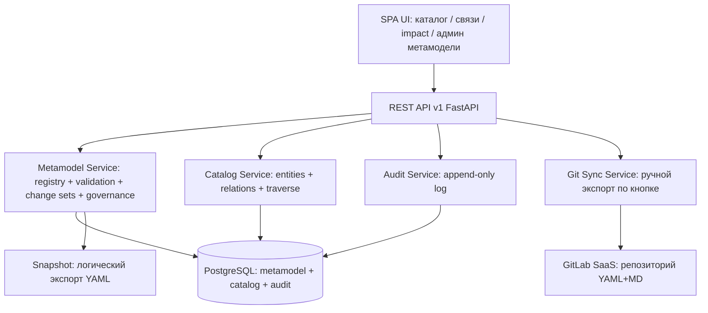
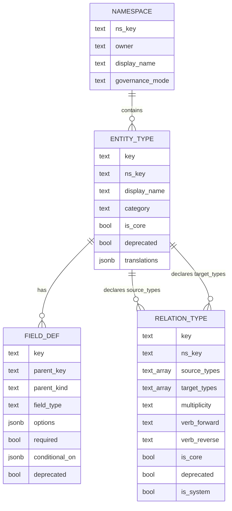
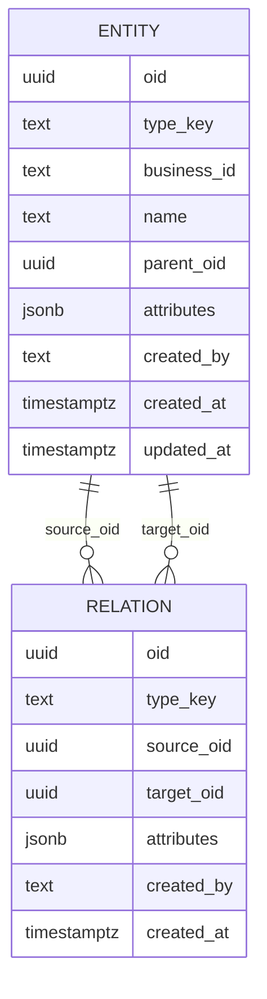
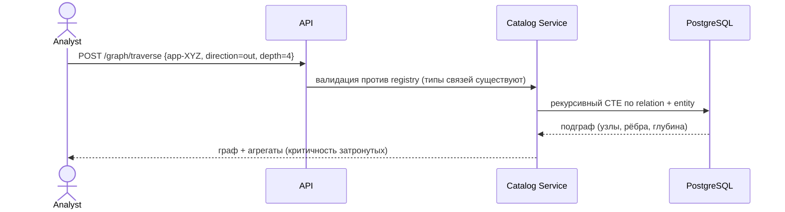
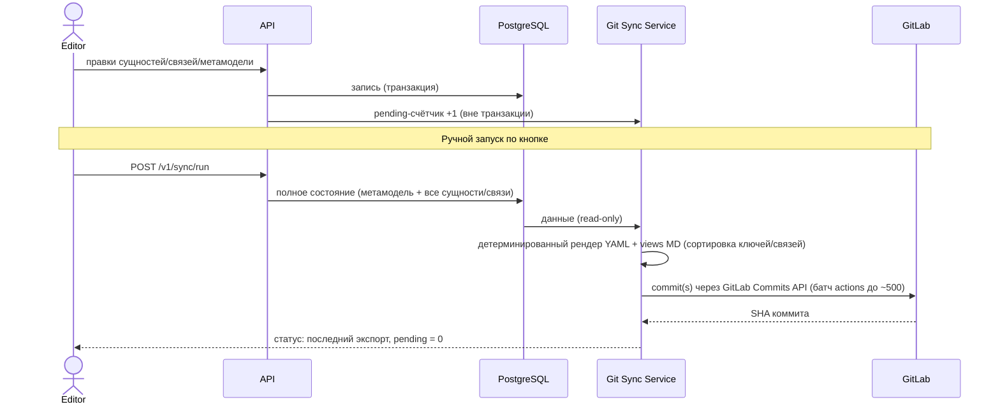

# Technical Design: Метамодель «ИТ Ландшафт» (v1.3)

**Author**: Stuart (architect role)

**Date**: 2026-10-04

**Status**: Approved — v1.5. Все OQ решены владельцем продукта (2026-10-04): стек FastAPI/Python + PostgreSQL + React; business_id immutable; person + бизнес/ИТ-владельцы; single workspace; Docker Compose; RBAC 3 роли; OKF = Open Knowledge Format (спека Google v0.1 — OKF-конформность Markdown-слоя, §10.6, ADR-0007); GitLab SaaS; синхронизация — ручной режим по кнопке (OQ-9); business_id = PREFIX-slug (человекочитаемые идентификаторы, ADR-0008); ядро 15 типов + 20 связей (technology/technology_category, department + organization, initiative subtype — ADR-0008).

**История изменений**: v1.0 (Draft) → v1.1: стек FastAPI/Python (было допущением NestJS); модель владения — два типа связей (business/IT owner); новый компонент Git Sync Service + формат репозитория GitLab (YAML+Markdown, ADR-0006); приоритет — веб-версия. → v1.2: OQ-7/8 решены (OKF = Open Knowledge Foundation → Frictionless Data Package как слой пакетирования, `datapackage.yaml`; GitLab SaaS); OQ-9 переформулирован простым языком. → v1.3: OQ-7 уточнён владельцем — OKF = **Open Knowledge Format** (трактовка организации/Frictionless снята, `datapackage.yaml` отложен); OQ-9 решён — **синк в ручном режиме по кнопке** (A-7, NG8; NFR-7 переписан на pending-счётчик); ADR-0006 Accepted. → v1.4: OQ-7 закрыт окончательно — OKF = спека **Open Knowledge Format** от Google (v0.1, 2026-06, ссылка от владельца); ADR-0007: генерируемый Markdown-слой репозитория OKF-конформен (концепт на сущность, frontmatter, связи = markdown-ссылки = граф); lossless YAML-слой без изменений; файлы при 20k сущностей ~2x (§17). → v1.5: правки владельца (2026-10-04, ADR-0008): business_id = PREFIX-slug (человекочитаемые идентификаторы на латинице вместо номеров, immutable); типы it_component → technology, tech_category → technology_category; organization разделён на department (подразделения) + organization (юрлица/внешние), новая связь rel_department_of_organization, rel_person_member_of_org → rel_person_member_of_department; initiative получил subtype (project/roadmap/program); ядро 15 типов + 20 связей. oid = UUIDv7 (без изменений).

**Вход**: research-отчёт `_bmad-output/initiative-it-landscape/research-enterprise-architecture-management-metam/research-enterprise-architecture-management-metam.md` (рекомендации DI-1…DI-14), 6 ADR в этом каталоге.

---

## 1. Summary

Технический дизайн метамодели продукта «ИТ Ландшафт Small» — компактного инструмента управления архитектурой предприятия (EAM) для аналитиков. Дизайн определяет: (1) ядро из 15 типов сущностей, описанных данными (EntityType registry), а не кодом; (2) типизированные направленные связи как first-class сущности с собственными атрибутами и immutable multiplicity; (3) namespaced-механизм расширений (custom поля/типы/связи); (4) governance-лестницу Off/Guided/Strict; (5) версионированную эволюцию метамодели через change sets с песочницей и dry-run; (6) GitLab-зеркало метамодели и данных в формате YAML+Markdown (P1 — ручной экспорт по кнопке, P2 — PR-flow).

Дизайн закрывает фазу «архитектурный дизайн» инициативы `it-landscape` и является спецификацией для последующей разработки. Приоритет реализации — веб-версия (API + UI). Все решения приняты по критерию «простейшее жизнеспособное решение» для малой команды — это не LeanIX-клон.

## 2. Goals

- **G1.** Словарь метамодели (типы, поля, связи) описан данными в реестре, не кодом — добавление типа/поля не требует релиза (DI-1, DI-5).
- **G2.** Связи — first-class направленные сущности с атрибутами и immutable multiplicity; impact-анализ по графу (DI-2, DI-3).
- **G3.** Управляемая эволюция метамодели: change sets + снапшот + dry-run diff + отдельная версия метамодели (DI-7) — точка дифференциации (research insight 6).
- **G4.** Governance: тройка Source→Relation→Target валидируется, режимы Off/Guided/Strict, неретроактивность (DI-6).
- **G5.** Идентификация: immutable OID + бизнес-ID + external IDs; переименования только presentation-level (DI-4, DI-12).
- **G6.** GitLab как зеркало (P1) и будущий review-гейт (P2): детерминированный lossless-экспорт YAML+Markdown (ADR-0006).
- **G7.** Реализация малой командой: modular monolith, один движок, минимум движущихся частей; приоритет — веб-версия.

## 3. Non-goals

- **NG1.** ArchiMate-импорт/экспорт в v1 (DI-11): ядро готово к exchange-адаптеру, но сам адаптер — последующий exchange-пак.
- **NG2.** Packaged verticals / use-case шаблоны в v1 (DI-10): механика change sets готова к упаковке вертикалей как экспортируемых пакетов, но сама упаковка — после v1.
- **NG3.** Мульти-воркспейсность / мультиарендность: single workspace в v1 (подтверждено владельцем).
- **NG4.** Полный мотивационный слой стандартов (DI-14): только Initiative.
- **NG5.** Слои как структурные сущности (DI-8): слой = категория типа + представления.
- **NG6.** **Двусторонний PR-flow GitLab (P2)** — следующий этап: изменения через Merge Request + CI-валидация + импорт по merge. В v1 GitLab — read-only зеркало с автоэкспортом (ADR-0006).
- **NG7.** Discovery-интеграции (CMDB-синхронизация и т.п.) — через external_ids позже.
- **NG8.** Автоматическая синхронизация в GitLab (debounce/расписание) — не в v1: экспорт только вручную по кнопке (OQ-9); авто-режимы — опциональная конфигурация Git Sync позже.

## 4. Context

Репозиторий greenfield. Стек подтверждён владельцем продукта: Python/FastAPI + PostgreSQL + React. Продукт для EA/ИТ-аналитиков: ведение каталога приложений и ИТ-компонентов, связности, impact-анализ («что сломается, если выключить X»).

Ключевой контекст из research: все четыре референса (LeanIX, Ardoq, Essential, Backstage) сошлись на форме «компактное prescriptive-ядро + направленные типизированные связи first-class + namespaced-расширения»; эволюция метамодели — слабое место всех четырёх, выбрана как точка дифференциации.

Требование владельца продукта (2026-10-04): метамодель и все собранные данные должны храниться в GitLab в формате YAML + Markdown; в перспективе все изменения — через PR; на первом этапе отправка изменений в GitLab — **вручную по кнопке** (уточнение OQ-9). Приоритет — веб-версия системы. «OKF» = Open Knowledge Format (спека Google v0.1) — интеграция в §10.6, ADR-0007.

## 5. Requirements

### Functional Requirements (свернуты из DI-1…DI-14 + решения владельца)

- **FR-1.** Каталог сущностей 14 core-типов: CRUD, фильтрация по типу/полям, полнотекстовый поиск по имени, массовый импорт CSV/JSON.
- **FR-2.** Связи: направленные, типизированные (каталог типов связей), с собственными атрибутами; verb-лейблы на оба направления; multiplicity на типе связи, immutable после создания.
- **FR-3.** Impact-анализ: обход графа от сущности (направление, типы связей, глубина, фильтры по атрибутам).
- **FR-4.** Метамодель редактируется только через change sets (UI-админ); применение с обязательным снапшотом, dry-run diff и bump версии метамодели.
- **FR-5.** Расширения: custom поля (типизированные, namespaced ключи), custom типы сущностей, custom типы связей, enum-опции, conditional-поля — тем же механизмом registry, что и ядро.
- **FR-6.** Governance: валидация тройки Source→Relation→Target и схемы полей; режимы Off/Guided/Strict per namespace; отчёт валидации существующих данных (неретроактивно).
- **FR-7.** Идентификация: внутренний OID (immutable), человекочитаемый business_id (уникальный per тип, immutable), external_ids (namespaced map); переименование — только display name / переводы.
- **FR-8.** Audit: append-only лог всех мутаций модели и метамодели (кто/когда/что), экспортируемый.
- **FR-9.** Универсальный parent-child (один родитель, системный) + произвольные иерархии как typed relations.
- **FR-10.** Представления (views): сохраняемые фильтры/колонки — презентационный слой (v1-lite).
- **FR-11.** Владение: у моделируемых сущностей — бизнес-владелец и ИТ-владелец (person, department или organization) через два явных типа связей `rel_business_owner` / `rel_it_owner` (решение владельца, OQ-3).
- **FR-12.** GitLab-интеграция P1 (в v1): экспорт метамодели и данных в репозиторий GitLab в формате YAML + Markdown **по ручному запуску** (кнопка в UI / `POST /v1/sync/run`); детерминированная сериализация (стабильные diff); полная регенерация = самозалечивающая реконсиляция. P2 (вне v1): PR-flow — изменения через MR с валидацией (ADR-0006).

### Non-functional Requirements

- **NFR-1.** Производительность: p95 read API < 300 мс при 20k сущностей / 100k связей; обход графа глубины ≤ 4 < 2 с.
- **NFR-2.** Доступность 99% (внутренний инструмент, single instance).
- **NFR-3.** Консистентность: сильная (метамодель и данные в одной транзакционной БД).
- **NFR-4.** Долговечность: RPO ≤ 24 ч (ежедневный бэкап) + автоматический снапшот перед каждым apply change set; RTO ≤ 4 ч. GitLab-зеркало — дополнительная независимая копия.
- **NFR-5.** Безопасность: AuthN OIDC; RBAC admin/editor/viewer; audit log immutable; GitLab PAT в secret store.
- **NFR-6.** Наблюдаемость: structured logs с request id, RED-метрики, /healthz; статус зеркала — API + UI.
- **NFR-7.** Управляемость зеркала: UI и API всегда показывают время последнего успешного экспорта и счётчик несинхронизированных изменений (pending); экспорт — ручной, идемпотентный, не блокирует работу веб-версии.

## 6. Constraints

- **C1.** Продукт «Small»: команда 1–3 разработчика; простота важнее полноты; оверинжиниринг запрещён.
- **C2.** Канонический словарь ArchiMate 4 недоступен без лицензии — ядро на собственном компактном словаре.
- **C3.** Ни один core-механизм не требует изменения кода при добавлении типа/поля/связи (DI-1, G1).
- **C4.** Immutable после создания: ключи типов/полей/типов связей, multiplicity, тип поля, направление связи, OID, business_id (подтверждено владельцем, OQ-2).
- **C5.** Изменения ядра метамодели — additive-only; удаление/сужение только через deprecation (DI-7).
- **C6.** GitLab-представление lossless и детерминировано: экспорт → импорт → экспорт даёт идентичное дерево (round-trip, ADR-0006); формат — основа будущего PR-flow (P2).

## 7. Assumptions

- **A-1.** Стек (**подтверждено владельцем**, OQ-1): Python 3.12+ / FastAPI + Pydantic v2, SQLAlchemy 2.0 + Alembic, PostgreSQL 16 (JSONB); фронтенд — React SPA (TypeScript).
- **A-2.** Масштаб: ≤ 20k сущностей, ≤ 100k связей, ≤ 50 одновременных пользователей, один workspace (подтверждено, OQ-4).
- **A-3.** Деплой: Docker Compose (app + PostgreSQL), managed БД (подтверждено, OQ-5).
- **A-4.** Локализация: UI RU+EN; у типов метамодели поле `translations`; у инстансов v1 — только `name`.
- **A-5.** Аутентификация через внешний OIDC-провайдер; локальных паролей нет.
- **A-6.** GitLab: **SaaS (gitlab.com)**, доступ по HTTPS с project access token / PAT в secret store (решено, OQ-8); один репозиторий для метамодели и данных.
- **A-7.** Синхронизация P1 (**решено, OQ-9**): **ручной запуск по кнопке** — полная детерминированная регенерация репозитория GitLab из БД; автоматических выгрузок (debounce/расписание) нет.

## 8. Architecture Drivers

1. **Расширяемость без кода** — главное продуктовое обещание (DI-1, DI-5).
2. **Доверие аналитиков к данным** — governance, audit, откат изменений метамодели, **Git-зеркало как независимая наблюдаемость** (DI-6, DI-7, DI-13, ADR-0006).
3. **Скорость реализации** — малая команда; приоритет владельца — веб-версия (G7).
4. **Корректность связей** — impact-анализ ключевая ценность → типизация троек и валидация обязательны (G4).

## 9. Proposed Architecture

Modular monolith из четырёх сервисных модулей в одном деплое, общая PostgreSQL:



Ключевые свойства:

- **Единственная точка записи** в данные — Catalog Service, валидирующий каждую мутацию против registry (Metamodel Service). Закрывает «щели» governance, которые у Ardoq существуют из-за множества точек входа (research D3).
- **Единственный механизм мутации метамодели** — change sets (ADR-0005). Прямого редактирования типов в UI нет.
- **Git Sync** — ручной полный экспорт по кнопке: БД остаётся единственным источником истины, GitLab — детерминированное read-only зеркало (ADR-0006).
- Границы модулей — по схемам БД и внутреннему Python-модульному API; сетевых вызовов между модулями нет.

## 10. Components

### 10.1 Metamodel Service (ядро)

- **Responsibility**: хранит EntityType / RelationType / FieldDef как данные; валидация инстансов и троек; применение change sets (снапшот → dry-run → apply); governance-режимы per namespace; версия метамодели; отчёты валидации.
- **Interface**: внутренний Python-модуль + REST `/v1/metamodel/*`, `/v1/namespaces/*`, `/v1/change-sets/*`.
- **Dependencies**: PostgreSQL, Audit Service.
- **Technology**: FastAPI-модуль (Pydantic v2 как основа валидации, SQLAlchemy 2.0); таблицы `namespace`, `entity_type`, `relation_type`, `field_def`, `change_set`, `metamodel_state`.
- **Key decisions**: ADR-0001, ADR-0003, ADR-0004, ADR-0005.

### 10.2 Catalog Service

- **Responsibility**: CRUD entities/relations, запросы с фильтрами, traverse (impact-анализ), импорт/экспорт, универсальный parent-child.
- **Interface**: REST `/v1/entities/*`, `/v1/relations/*`, `/v1/graph/traverse`, `/v1/import`, `/v1/export`.
- **Dependencies**: Metamodel Service (валидация), PostgreSQL.
- **Technology**: FastAPI-модуль; таблицы `entity`, `relation`; traversal — рекурсивные CTE.
- **Key decisions**: ADR-0002, JSONB-атрибуты с валидацией на записи (ADR-0001).

### 10.3 Audit Service

- **Responsibility**: append-only журнал мутаций (модель + метамодели), уведомления админов о значимых изменениях метамодели (DI-13).
- **Interface**: REST `/v1/audit-events` (read-only), внутренний emit-API.
- **Technology**: таблица `audit_event`, партиционирование по месяцу (опционально).

### 10.4 Exchange

- **Responsibility**: v1 — импорт/экспорт CSV/JSON (с маппингом на registry); later — ArchiMate exchange-адаптер (DI-11), паки вертикалей (DI-10).
- **Technology**: модуль Catalog Service; отдельный модуль позже.

### 10.5 UI (SPA)

- **Responsibility**: каталог с фильтрами, карточка сущности с relations (включая бизнес-/ИТ-владельцев), редактор связей с verb-лейблами, impact-граф, админ-раздел метамодели (change set editor + dry-run diff viewer), governance-отчёты, статус GitLab-зеркала.
- **Technology**: React SPA (TypeScript). **Приоритет реализации — веб-версия** (решение владельца).

### 10.6 Git Sync Service

- **Responsibility**: экспорт состояния (метамодель + данные) в детерминированный YAML+Markdown по ручному запуску (кнопка в UI / `POST /v1/sync/run`); полный рендер репозитория из БД — самозалечивает дрейф; commit+push в GitLab; (P2) импорт результатов MR.
- **Interface**: REST `GET /v1/sync/status` (последний успешный экспорт + pending-счётчик несинхронизированных изменений), `POST /v1/sync/run` (ручной запуск, editor+). Фоновых воркеров, очередей и планировщика нет (A-7, NG8).
- **Dependencies**: Metamodel + Catalog (read-only), GitLab REST API (HTTPS, PAT в secret store).
- **Key decisions**: ADR-0006 (поэтапность, формат, round-trip).

**Структура репозитория GitLab (P1, генерируется автоматически):**

```
it-landscape/
├── README.md                        # генерируемый обзор: версия метамодели, статистика, карта типов
├── metamodel/
│   ├── version.yaml                 # metamodel_version + история применённых change sets
│   ├── namespaces.yaml              # namespaces + governance-режимы
│   ├── entity-types/
│   │   ├── application.yaml         # определение типа + его field defs
│   │   └── ...
│   └── relation-types/
│       ├── rel-app-supports-capability.yaml
│       └── ...
├── change-sets/
│   └── 0007-add-finance-field.yaml  # применённые change sets как артефакты
├── entities/
│   ├── application/
│   │   ├── APP-1c-zup.yaml          # сущность + embedded relations
│   │   └── APP-1c-accounting.yaml
│   └── person/
│       └── PERS-maria-ivanova.yaml
└── views/                           # OKF-бандл (Open Knowledge Format v0.1, ADR-0007)
    ├── index.md                     # корневой OKF-индекс: навигация по графу
    ├── application/
    │   ├── index.md                 # генерируемая таблица приложений
    │   ├── APP-1c-zup.md             # OKF-концепт: frontmatter + «Relations» (ссылки = граф)
    │   └── APP-1c-accounting.md
    └── person/
        ├── index.md
        └── PERS-maria-ivanova.md
```

**Формат файла сущности (канонический):**

```yaml
apiVersion: it-landscape/v1
kind: Entity
metadata:
  oid: "0190c0de-0000-7000-8000-000000000001"
  type: application
  business_id: APP-1c-zup
  name: "1С:ЗУП"
  parent_id: null
attributes:
  lifecycle_status: active
  business_criticality: high
  finance:annual_cost: 120000
relations:
  - oid: "0190c0de-0000-7000-8000-00000000abcd"
    type: rel_business_owner
    target: person/maria-ivanova
    attributes: {}
  - oid: "0190c0de-0000-7000-8000-00000000effe"
    type: rel_it_owner
    target: person/alexey-petrov
    attributes: {}
```

Правила сериализации (C6): сортировка ключей и связей (по type, target), LF, UTF-8, стабильные ссылки `[type/]business_id`; change sets — YAML-артефакты (та же схема ops, что в API); Markdown — только генерируемые views/README (человекочитаемые обзоры для PR-review). Round-trip golden-тест обязателен (§19).

**OKF-конформность (OQ-7, решено — ADR-0007)**: OKF = **Open Knowledge Format** — открытая спецификация Google (v0.1, июнь 2026, ссылка от владельца): знание как директория Markdown-файлов с YAML frontmatter; концепт = один файл (путь = идентичность); связи через обычные markdown-ссылки превращают директорию в граф; единственное обязательное поле frontmatter — `type`, опциональные — `title`, `description`, `resource`, `tags`, `timestamp`; опциональны `index.md` (progressive disclosure) и `log.md`. Принципы спеки: minimally opinionated, независимость producer/consumer, format-not-platform. Наша интеграция: генерируемый Markdown-слой (`views/`) — OKF-бандл: концепт на сущность (frontmatter `type: it-landscape/<type>`, title, description, tags, timestamp) + «Relations» с ссылками на связанные сущности; reference HTML-визуализатор из репозитория спеки строит из бандла интерактивный граф (требование владельца — «удобное формирование графа данных»); Google Cloud Knowledge Catalog умеет ingest OKF. Lossless YAML-слой (`entities/`, `metamodel/`, `change-sets/`) без изменений — машинный контракт и round-trip (ADR-0006); версия спеки OKF фиксируется в `metamodel/version.yaml`. Ограничение: в v0.1 ссылки нетипизированы — типизированная семантика связей остаётся в YAML и в секции «Relations» концепта.

## 11. Data Model

### 11.1 Метауровень (M2) — реестр метамодели



- `FIELD_DEF.parent_kind ∈ {entity_type, relation_type}` — поля определяются и для типов сущностей, и для типов связей (DI-2).
- `RELATION_TYPE.is_system` — системные связи (parent-child) вне пользовательского каталога.
- `NAMESPACE.governance_mode ∈ {off, guided, strict}` (ADR-0004).

### 11.2 Модель (M1) — данные



- `entity.attributes jsonb` — все поля типа, включая core-поля из registry. Валидация на записи против `field_def` (ADR-0001).
- Уникальность: `(type_key, business_id)` unique; `(type_key, source_oid, target_oid)` unique на `relation`.
- Индексы: `entity(type_key)`, `entity(parent_oid)`, GIN `entity(attributes)`, `relation(source_oid)`, `relation(target_oid)`, `relation(type_key)`.
- Multiplicity: `n:1` → unique `(type_key, source_oid)`; `1:n` → unique `(type_key, target_oid)`; `1:1` → обе; `n:m` → без ограничения.
- Иерархия: `parent_oid` nullable, один родитель; разворот дерева — рекурсивный CTE.
- Ссылки на сущности — каноническая тройка `{type, business_id, oid}`; в Git-формате — строка `[type/]business_id` (DI-12).

### 11.3 Идентификация (DI-12)

| Слой | Что | Immutable | Пример |
|---|---|---|---|
| Внутренний | `oid` — UUIDv7 | да | `0190c0de-...` |
| Бизнес | `business_id` — уникален per тип, формат `PREFIX-slug` (человекочитаемый, ADR-0008) | **да (подтверждено владельцем, OQ-2)** | `APP-1c-zup` |
| Внешний | `external_ids` — namespaced map в attributes | значения свободны | `{"jira": "ABC-123"}` |
| Отображение | `name` + переводы у типов | нет — переименование свободно | «1С:ЗУП» |

business_id = `PREFIX-slug`: префикс фиксирован per тип (`APP`, `SYS`, `IF`, `CAP`, `PROC`, `TECH`, `TECHCAT`, `RES`, `PLAT`, `DATA`, `DEP`, `ORG`, `PERS`, `PRV`, `INIT`); slug — человекочитаемая метка на латинице (строчные, `[a-z0-9-]`, ≤ 64 символа; кириллица/пробелы/двоеточия нормализуются в дефис, система подсказывает транслит), уникален в пределах типа, задаётся при создании с валидацией. После создания не меняется (OQ-2): переименование элемента меняет только `name`; slug — идентификатор, а не название, и не обязан отслеживать переименования (ADR-0008). Ключи типов/полей/связей неизменяемы; переименование — только display name и переводы (DI-4).

### 11.4 Ядро типов сущностей (seed registry, 15 типов + 2 опциональных)

| # | key | Display | Категория | Назначение / ключевые поля (в registry) |
|---|-----|---------|-----------|------------------------------------------|
| 1 | `application` | Application | application | ПО, поддерживающее бизнес. `lifecycle_status` (planned/active/retiring/retired), `business_criticality` |
| 2 | `system` | System | application | Группа приложений, выставляющая возможности наружу (Backstage-паттерн) |
| 3 | `interface` | Interface | application | Граница/API между приложениями. `protocol`, `visibility` (public/restricted/private) |
| 4 | `technology` | Technology | technology | Конкретная технология: SaaS/IaaS/PaaS/Software/Hardware/Service — через `subtype` (ADR-0008) |
| 5 | `technology_category` | Technology Category | technology | Каталог технологических категорий (ADR-0008) |
| 6 | `resource` | Resource | technology | Инфраструктурный ресурс: сервер, кластер, БД-инстанс, облако-аккаунт. `environment` |
| 7 | `platform` | Platform | technology | Стратегическая технологическая платформа (ERP, Cloud, CRM) |
| 8 | `business_capability` | Business Capability | business | Что умеет бизнес. `level` (L1/L2/L3) |
| 9 | `process` | Process | business | Бизнес-процесс / контекст |
| 10 | `data_object` | Data Object | data | Информационный актив. `pii` (bool), `classification` |
| 11 | `department` | Department | organizational | Подразделение/команда внутри компании; иерархия через parent (ADR-0008) |
| 12 | `organization` | Organization | organizational | Юрлицо/внешняя организация/клиент/партнёр — через `subtype` (legal-entity/client/partner); департаменты привязываются связью `rel_department_of_organization` (ADR-0008) |
| 13 | `person` | Person | organizational | Человек; выступает **бизнес-владельцем** или **ИТ-владельцем** через связи `rel_business_owner` / `rel_it_owner` (OQ-3). `email` |
| 14 | `provider` | Provider | organizational | Вендор/поставщик |
| 15 | `initiative` | Initiative | governance | Проект, программа или дорожная карта продуктовой команды на квартал — через `subtype` (project/roadmap/program); иерархия program→project через parent. `status`, `timeframe` (ADR-0008) |
| opt | `domain` | Domain | application | Bounded context над системами — пример extension-типа из core-пака |
| opt | `objective` | Objective | governance | Цель — пример extension-типа (DI-14: мотивационный слой не копируем) |

Категория — только навигация/презентация (DI-8). Опциональные типы подключаются seed change set'ом — демонстрация механики вертикалей (DI-10).

### 11.5 Ядро типов связей (seed, 20 + системная)

| key | Source → Target | Mult | Verbs fwd / rev | Поля связи |
|---|---|---|---|---|
| `rel_app_supports_capability` | application → business_capability | n:m | supports / supported-by | — |
| `rel_app_part_of_system` | application → system | n:1 | part-of / has-part | — |
| `rel_system_part_of_domain` | system → domain | n:1 | part-of / has-part | — |
| `rel_app_provides_interface` | application → interface | 1:n | provides / provided-by | — |
| `rel_app_consumes_interface` | application → interface | n:m | consumes / consumed-by | — |
| `rel_app_depends_on_app` | application → application | n:m | depends-on / dependency-of | `dependency_kind` (runtime/data/upgrade) |
| `rel_app_runs_on_technology` | application → technology | n:m | runs-on / hosts | `cost_monthly`, `environment` |
| `rel_process_uses_app` | process → application | n:m | uses / used-by | — |
| `rel_technology_belongs_to_category` | technology → technology_category | n:1 | belongs-to / includes | — |
| `rel_technology_implements_platform` | technology → platform | n:m | implements / implemented-by | — |
| `rel_resource_hosts_technology` | resource → technology | n:m | hosts / hosted-on | — |
| `rel_provider_offers_technology` | provider → technology | n:m | offers / offered-by | `license_model`, `cost_monthly` |
| `rel_provider_provides_app` | provider → application | n:m | provides / provided-by | `license_model` |
| `rel_business_owner` | [person, department, organization] → [application, system, technology, resource, platform, data_object, interface, domain, process] | n:m | owns / owned-by | — (семантика роли — в типе связи, OQ-3) |
| `rel_it_owner` | [person, department, organization] → [тот же список target] | n:m | owns / owned-by | — |
| `rel_person_member_of_department` | person → department | n:m | member-of / has-member | — |
| `rel_department_of_organization` | department → organization | n:1 | belongs-to / includes | — |
| `rel_initiative_affects` | initiative → [application, technology, process, platform, data_object, business_capability] | n:m | affects / affected-by | — |
| `rel_interface_transfers_data` | interface → data_object | n:m | transfers / transferred-by | — |
| `rel_app_accesses_data` | application → data_object | n:m | accesses / accessed-by | `access_type` (create/read/update/delete, multi) |
| `parent_of` (system) | * → * | n:1 | parent-of / child-of | универсальный parent-child, реализован `parent_oid`, неудаляем как механизм (DI-9) |

**Решение по владению (OQ-3)**: два явных типа связей вместо одной связи с enum-полем роли. Обоснование: (1) уникальность `(type, source, target)` не блокирует человека, являющегося одновременно бизнес- и ИТ-владельцем одной сущности (две связи разных типов); (2) явная типизация дружелюбнее к governance и UI-лейблам; (3) будущие роли (например security_owner) добавляются additive change set'ом — тот же паттерн. Направление «владелец → сущность» (LeanIX-паттерн): traverse «что владеет человек X» — прямой обход, «кто владеет приложением Y» — обратный.

Multiplicity нотация: `n:1` = много source на один target. Мульти-типовые концы (`source_types[]`/`target_types[]`) — расширение нотации LeanIX `relAtoB` (ключ связи один, допустимые пары — списком).

### 11.6 Расширения (DI-5, ADR-0003)

Ключи core-типов/полей/связей — без префикса. Расширения — только в зарегистрированных namespace: ключ `<ns>:<name>`. Зарезервированы `core` и `sys`. Механизмы те же: `FieldDef`, `EntityType`, `RelationType` с `ns_key ≠ core`. Примеры: поле `finance:annual_cost` на Application; тип связи `mymesh:integrates_with`; тип `hr:employee`. Conditional-поля: `conditional_on = {field_key, values}` (паттерн LeanIX conditional attributes).

## 12. APIs / Contracts

REST JSON, версионирование пути `/v1`. Ошибки — RFC 7807 problem+json.

| Method | Path | Description | Auth |
|---|---|---|---|
| GET | `/v1/metamodel` | Полный реестр (типы, поля, связи, namespaces, версия) | Bearer |
| GET | `/v1/metamodel/entity-types/{key}` | Один тип с полями | Bearer |
| GET | `/v1/entity-types` / `/v1/relation-types` / `/v1/namespaces` | Срезы реестра | Bearer |
| POST | `/v1/change-sets` | Создать change set (ops[]) | admin |
| POST | `/v1/change-sets/{id}/dry-run` | Dry-run на снапшоте → diff-отчёт | admin |
| POST | `/v1/change-sets/{id}/apply` | Применить (снапшот обязателен) | admin |
| GET | `/v1/change-sets` | История изменений метамодели | admin |
| GET/POST | `/v1/entities` | Список (фильтры type, fields, q, parent) / создание | Bearer |
| GET/PATCH/DELETE | `/v1/entities/{oid}` | Карточка / обновление / удаление (soft) | Bearer |
| GET/POST | `/v1/entities/{oid}/relations` | Связи сущности (обе стороны) / создание связи | Bearer |
| GET/POST | `/v1/relations` / PATCH/DELETE `/v1/relations/{oid}` | Связи как ресурс (атрибуты связи) | Bearer |
| POST | `/v1/graph/traverse` | Impact-анализ: `{start_oid, direction, relation_types?, depth, filters?}` | Bearer |
| GET | `/v1/validation/report` | Отчёт валидации существующих данных (неретроактивность) | Bearer |
| POST | `/v1/import` / GET `/v1/export` | CSV/JSON | editor |
| GET | `/v1/audit-events` | Журнал (фильтры actor/subject/period) | admin |
| GET | `/v1/sync/status` | Статус GitLab-зеркала (последний успешный экспорт, pending-счётчик) | Bearer |
| POST | `/v1/sync/run` | Ручной запуск экспорта: полная перегенерация репозитория из БД | editor |

Контракт `ChangeSetOp` (дискриминант `op`): `entity_type.add`, `entity_type.deprecate`, `field.add`, `field.deprecate`, `field.set_conditional`, `enum_option.add`, `relation_type.add`, `relation_type.deprecate`, `namespace.add`, `display_name.update`, `governance.set_mode`. Запрещены: `field.type.change`, `multiplicity.change`, `key.rename`, `entity_type.delete` для core (C4, C5). Change sets сериализуются в YAML как артефакты репозитория (ADR-0006).

## 13. Integrations

| System | Direction | Protocol | SLA | Failure handling |
|---|---|---|---|---|
| GitLab | Outbound (P1) / Bidirectional (P2) | GitLab REST API + Git over HTTPS, PAT (SaaS gitlab.com) [A-6] | best-effort (NFR-7) | запуск только вручную (`POST /v1/sync/run`); при недоступности GitLab — ошибка экспорта, pending-счётчик растёт, повторная попытка — следующим ручным запуском; статус в `/v1/sync/status` |
| OIDC IdP | Outbound | OIDC/HTTPS | 99.9% | кэш JWKS, отказ → readonly-режим [A-5] |
| Archi (ArchiMate exchange) | Inbound, post-v1 | Open Exchange XML file | — | импорт с визуальным маппингом (DI-11) |
| Jira/CRM и пр. | Outbound, post-v1 | REST + external_ids | — | вне v1 |

## 14. Key Flows

### Flow 1: Применение change set (главный governance-флоу)

```mermaid
sequenceDiagram
    actor Admin
    participant API
    participant MM as Metamodel Service
    participant SNAP as Snapshot
    participant DB as PostgreSQL
    participant AUD as Audit
    participant GS as Git Sync

    Admin->>API: POST /change-sets {ops[]}
    API->>MM: валидация ops (additive-only, immutable-правила)
    MM->>SNAP: снапшот метамодели + данных
    Admin->>API: POST /change-sets/{id}/dry-run
    API->>MM: применить на копии снапшота
    MM-->>Admin: diff-отчёт: затронутые типы, backfill, нарушения Strict
    Admin->>API: POST /change-sets/{id}/apply
    API->>DB: транзакция: ops + bump metamodel_version
    API->>AUD: audit(change_set.applied, diff)
    MM->>GS: pending-счётчик +1 (вне транзакции); экспорт в GitLab — только по кнопке POST /v1/sync/run
    MM-->>Admin: версия метамодели v1.3
```

Откат = восстановление снапшота (или обратный change set для метамодели).

### Flow 2: Impact-анализ



### Flow 3: Создание связи при Guided

Catalog проверяет тройку (source.type, relation.type, target.type) против registry: валидна → создать; невалидна и режим `guided` → HTTP 201 + `warnings[]` + пометка в отчёте валидации; режим `strict` → HTTP 422. Существующие данные при ужесточении не блокируются — только попадают в `/v1/validation/report` (неретроактивность, DI-6).

### Flow 4: GitLab-синхронизация (P1, ручной запуск)



Полный рендер из БД (не инкрементальный): каждый запуск перегенерирует репозиторий целиком и самозалечивает любой дрейф (забытые экспорты, сбои; ручные правки в GitLab перезаписываются — read-only зеркало). Между запусками UI показывает pending-счётчик несинхронизированных изменений. Расписаний, debounce и фоновых воркеров нет (A-7, NG8).

P2 (вне v1): MR → CI-валидация (схема/тройки/governance через API) → merge → webhook → импорт → apply (change sets становятся MR — синергия с ADR-0005).

## 15. Security Considerations

- **AuthN**: OIDC через внешний IdP [A-5].
- **AuthZ**: RBAC — `admin` (метамодель, namespaces, audit), `editor` (данные, запуск Git-синка), `viewer` (чтение, видит статус синка). Write в extension namespace в v1 — только admin.
- **Data protection**: TLS на транспорте; шифрование диска БД на уровне инфраструктуры [A-3]; PII минимален (`person.email`).
- **Secrets**: GitLab PAT и учётные данные IdP — env / secret store, не в коде и не в Git-репозитории продукта.
- **Audit**: append-only, immutable; все мутации данных и метамодели. В P1 изменения в GitLab-зеркале извне игнорируются (read-only mirror) — предупреждение в UI.
- **Input validation**: каждая запись валидируется против registry (схема-из-данных, Pydantic v2); SQL — параметризованные запросы/CTE.
- **Threat model (базовый)**: главный актив — целостность каталога; угрозы: mass-assignment в JSONB (закрыт валидацией), эскалация через импорт (валидация импорта идентична ручной записи), компрометация GitLab PAT (минимальные права: scoped project token, write-only repository), удаление метамоделью-каскадом (soft delete + снапшоты).

## 16. Reliability Considerations

- Single instance [A-2]; цель 99%.
- Отказ БД → приложение недоступно (graceful 503), данные восстановимы из бэкапа/снапшота; GitLab-зеркало — независимая копия для восстановления читаемого состояния.
- Отказ GitLab → данные не теряются (БД — источник истины): экспорт завершается ошибкой, pending-счётчик растёт; следующий ручной запуск (после восстановления GitLab) делает полный рендер и самозалечивает разрыв (NFR-7); запись в веб-версии не блокируется (Git-синк — вне критического пути).
- Отказ IdP → кэш JWKS, деградация в readonly.
- Бэкап: ежедневный + автоматический снапшот перед каждым apply change set (NFR-4). Restore тестируется в CI (E2E).

## 17. Scalability Considerations

- Масштаб [A-2] (20k/100k) — вертикального масштабирования и индексов достаточно.
- Узкое место — traversal: рекурсивные CTE с ограничением глубины; опция позже — материализованные проекции графа (не строить заранее).
- JSONB: GIN-индексы под фильтры; hot-поля — expression indexes по мере необходимости.
- Git-синк: полный рендер репозитория при 20k сущностей — ~20k YAML + ~20k OKF-концептов (.md) + индексы (ADR-0007); батч-коммиты через GitLab Commits API (до ~500 actions на коммит); полный рендер — на каждый ручной запуск, поэтому длительность экспорта мониторим (§18).

## 18. Observability

- **Logging**: structured JSON, request id, actor (из токена), уровень INFO/WARN/ERROR.
- **Metrics**: RED на API, счётчик применённых change sets, размер графа (entities/relations), длительность и исход экспортов, pending-счётчик несинхронизированных изменений.
- **Tracing**: не требуется v1 (monolith); корреляция через request id.
- **Alerting**: недоступность БД, рост 5xx, отказ бэкапа; для Git-синка — только сигнал в UI (`/v1/sync/status`: pending-счётчик и последняя ошибка), без автоматических алертов (ручной режим).
- **Audit** — продуктовая наблюдаемость метамодели (DI-13): история change sets + уведомления админам.

## 19. Testing Strategy

- **Unit**: валидатор registry (схема полей, тройки, multiplicity), парсер/рендер change set ops (additive-only инварианты), YAML-рендер (детерминизм).
- **Property-тесты**: применение произвольной последовательности валидных change sets не нарушает инварианты (immutable keys, версии монотонны, additive-only для core).
- **Integration**: API + PostgreSQL (pytest + testcontainers): CRUD, traverse, dry-run/apply, restore снапшота.
- **Golden round-trip**: export → (импорт в чистую БД) → export — деревья идентичны; фиксируется как обязательный тест ADR-0006.
- **OKF-конформность** (S6, ADR-0007): frontmatter всех `views/`-концептов содержит `type`; все внутренние markdown-ссылки бандла разрешаются; бандл открывается в reference OKF-визуализаторе.
- **Golden fixture**: seed registry v1.0 как фикстура всех тестов.
- **E2E**: Flow 1 (change set с откатом), Flow 2 (impact-анализ), Flow 4 (синк в локальный GitLab/эмулятор), импорт CSV.
- **Security**: SCA зависимостей в CI; параметризованные SQL — правило линтера.

## 20. Deployment / Runtime View

- Docker Compose: `app` (FastAPI; Git Sync выполняется по запросу `POST /v1/sync/run` — фоновые воркеры, outbox и планировщик не нужны) + `postgres` [A-3]. Без k8s в v1.
- **Важно различать**: миграции схемы БД приложения (Alembic, при релизе) ≠ change sets метамодели (данные, применяются администратором в рантайме).
- Environment: dev (seed demo-данных), prod. Feature flags не требуются v1.

## 21. Migration Plan

Не применимо: greenfield. Начальное состояние — seed change set «Metamodel v1.0» (15 типов + 20 связей), применяемый штатным механизмом change sets (механизм проверяет сам себя). Раздел оставлен по шаблону; содержимое — фиксация решения.

## 22. Rollback Plan

- **Деплой**: повторный деплой предыдущего образа; схема БД — обратно совместима на N-1 релиз (правило Alembic-миграций).
- **Change set**: снапшот перед apply обязателен → restore снапшота; длительность — минуты.
- **Git-синк**: экспорт идемпотентен (полный рендер из БД); сбойный экспорт устраняется повторным запуском (`POST /v1/sync/run`) после устранения причины.
- **Данные**: soft delete; восстановление из audit-журнала.

## 23. Alternatives Considered

| Alternative | Why rejected |
|---|---|
| Git как единственный источник истины с первого дня (Git-first) | PR-governance сразу, но импорт-пайплайн + конфликт-модель задержат веб-версию — против явного приоритета владельца; выбран поэтапный путь (ADR-0006). |
| Property graph DB (Neo4j) для хранения | Естественные traversal'ы, но: операционная сложность для малой команды, слабее транзакционность «метамодель+данные»; CTE на [A-2] масштабе достаточно. Переоценить при 10-кратном росте. |
| Hardcoded core-типы в коде | Каждое расширение = релиз — нарушает C3. |
| Полный EAV | Запросы и производительность существенно сложнее; JSONB даёт ту же гибкость с простотой SQL. |
| Reified relations (связь = тоже entity, Essential-стиль) | Удвоение модели и UI-сложности; для «Small» оверинжиниринг — ADR-0002, вариант 3. |
| Live-редактирование метамодели (Ardoq-стиль) | Необратимые ошибки, нет версий — против G3; выбран change-set путь. |
| GraphQL API | Второй контракт + сложность для малой команды; REST + traverse-эндпоинт покрывает потребность. |
| Слои как сущности метамодели | Против всех четырёх референсов (DI-8). |
| Одна связь владения с enum-полем роли (business/IT) | Коллизия с unique-ограничением тройки (человек — одновременно бизнес- и ИТ-владелец); явные два типа связей чище для governance и UI (OQ-3). |

## 24. Trade-offs

| Trade-off | Что получаем | Что теряем |
|---|---|---|
| JSONB-атрибуты вместо колонок | Схема из данных, расширения без миграций | Нет DB-типизации полей; компенсация — валидатор registry + тесты |
| Change sets вместо live-edit | Воспроизводимость, откат, дифференциация (insight 6) | Friction при изменении метамодели; обход — auto-apply single-op в режиме `off` |
| Multiplicity immutable (DI-3) | Стабильные интеграции и семантика графа | Смена multiplicity = deprecate типа + новый тип — осознанно |
| Два типа связей владения вместо enum-роли | Чистые unique-ограничения, явная типизация, additive-расширение ролей | Больше типов в каталоге связей (2 вместо 1) |
| БД — источник истины в P1, GitLab — зеркало | Веб-версия без задержки; Git даёт бэкап/наблюдаемость/эволюцию к PR-flow | В P1 правки в GitLab напрямую невозможны (mirror read-only); дрейф возможен при забытых ручных экспортах — митигируется pending-счётчиком и самозалечивающим полным рендером |
| REST вместо GraphQL | Один простой контракт | Много запросов там, где GraphQL дал бы один; traverse закрывает главный случай |
| Single workspace v1 | Простота модели и безопасности | Мульти-командность позже потребует тенант-слоя |
| Parent-child как parent_oid | Дешёвое дерево, один механизм (DI-9) | Иерархия одна; произвольные — через typed relations |

## 25. Risks and Mitigations

| Risk | Probability | Impact | Mitigation |
|---|---|---|---|
| JSONB-спраул: поля без дисциплины | Med | Med | Governance ladder (ADR-0004) + отчёт валидации + namespaces |
| Дрейф БД ↔ GitLab-зеркало (забытые ручные экспорты) | Med | Med | Pending-счётчик в `/v1/sync/status` + самозалечивающий полный рендер при каждом запуске + golden round-trip тесты |
| Слом формата YAML при эволюции метамодели (блокирует P2-импорт) | Med | High | `version.yaml` в репозитории; формат additive-only; golden round-trip тесты на каждое изменение сериализации |
| «Щели» governance | Low | Med | Единственная точка записи (Catalog Service) |
| Friction change sets отпугнёт админов | Med | Med | Auto-apply single-op в режиме `off`; шаблоны ops в UI |
| Traversal деградирует на росте графа | Low | Med | Ограничение глубины, индексы; при 10× — read-модель (§17) |
| Утерянные детали референсов (low-confidence claims research) | Low | Low | Дизайн опирается на high-confidence находки; OQ research не блокируют v1 |

## 26. Open Questions

**Решены владельцем продукта (2026-10-04):**

- ~~OQ-1. Стек~~ → **FastAPI/Python + PostgreSQL + React** (A-1 обновлён).
- ~~OQ-2. business_id immutable~~ → **да**.
- ~~OQ-3. person отдельный тип~~ → **да, с бизнес-владельцем и ИТ-владельцем** (FR-11, два типа связей — §11.5).
- ~~OQ-4. Single workspace v1~~ → **да**.
- ~~OQ-5. Деплой Docker Compose~~ → **да**.
- ~~OQ-6. RBAC 3 роли~~ → **да**.

**Решены (второй раунд, 2026-10-04):**

- ~~OQ-7. OKF~~ → **Open Knowledge Format** — открытая спека Google (v0.1, июнь 2026; ссылка предоставлена владельцем 2026-10-04). Интеграция — ADR-0007: генерируемый Markdown-слой GitLab-репозитория OKF-конформен (концепт на сущность, связи = граф, reference-визуализатор); lossless YAML-слой без изменений.
- ~~OQ-8. GitLab~~ → **SaaS (gitlab.com)**, HTTPS + project access token / PAT в secret store, один репозиторий на метамодель+данные.

**Решены (третий раунд, 2026-10-04):**

- ~~OQ-9. Ритм синхронизации P1~~ → **ручной запуск по кнопке** (`POST /v1/sync/run`, editor): экспорт = полная детерминированная регенерация репозитория из БД, самозалечивает дрейф; автоматических выгрузок (debounce/расписание) в v1 нет (A-7, NG8); UI показывает pending-счётчик несинхронизированных изменений (NFR-7).

**Открыт:**

- **OQ-10.** P2 PR-flow: защищать ли `main` (protected) и кто ревьюит MR — те же админы или расширенный круг? К обсуждению на этапе P2.

## 27. Recommended Next Steps

1. **Декомпозиция** (`decompose-change`) — вертикальные срезы, приоритет — веб-версия:
   - **S1 Foundation**: scaffold FastAPI + Alembic + React; схема БД M1/M2; seed change set «Metamodel v1.0» (15 типов + 20 связей); CRUD entities API. Проверка: CRUD через API, seed применён change set'ом.
   - **S2 Relations + traverse**: связи как ресурс, multiplicity/unique, impact-анализ (CTE), валидация троек. Проверка: E2E Flow 2.
   - **S3 Change sets**: dry-run/apply, снапшот, версия метамодели, audit. Проверка: E2E Flow 1 + откат.
   - **S4 Extensions + governance**: namespaces, custom поля/типы, лестница Off/Guided/Strict, validation report. Проверка: тест-матрица режимов.
   - **S5 Web UI** (приоритет владельца): каталог, карточка с владельцами, связи, impact-граф, админ change sets.
   - **S6 GitLab P1**: Git Sync Service, формат репозитория, ручной запуск по кнопке (`POST /v1/sync/run` — полный рендер; OKF-конформный Markdown-слой, ADR-0007; не зависит от S5; после S2/S3).
2. **PRD** (product-роль) на основе FR-1…FR-12 — вход в разработку.
3. **P2 (отдельный этап)**: PR-flow GitLab (MR + CI-валидация + импорт), ArchiMate-адаптер, вертикали (DI-10, DI-11).

---

### Соответствие шаблону

Раздел 21 (Migration Plan) — фиксация N/A-решения (greenfield); раздел 13 (Integrations) — v1-минимум + GitLab; остальные разделы на месте. NFR-чеклист пройден: §5 (NFR-1…7), §15–18, §25; осознанно не применимы для v1: multi-AZ/DR-гео (single instance, C1), PII-классификация сверх `person.email`, compliance-режимы (SOC2 и т.п.) — вне скоупа малого инструмента.
