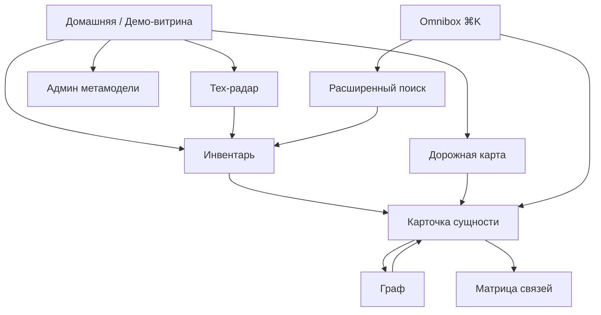
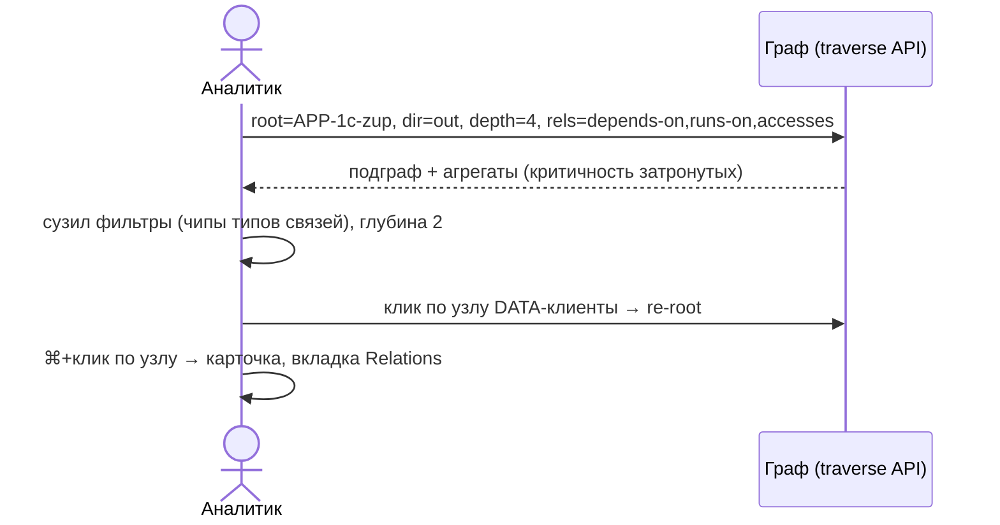

# Дизайн экранов «ИТ Ландшафт» (v1.0)

## 1. Summary

Этот документ — дизайн-фаза UI продукта «ИТ Ландшафт Small» (React SPA над метамоделью по файлу техдизайна). Он превращает 9 рекомендаций technical research в проверяемую спецификацию экранов и задаёт границу между данными и кодом:

**В метамодели — данные (типы, поля, секции, порядок, приоритеты). В коде — фиксированные React-модули отображения (таблица, карточка, граф, timeline, радар, поиск), параметризуемые этими данными. В app-config — только per-environment опции.** Ни один экран не знает имён конкретных типов (анти-паттерн LeanIX, research D7).

Продукт: 7 продуктовых модулей (Инвентарь, Карточка сущности, Граф, Дорожная карта, Тех-радар, Поиск, Домашняя/Демо) + 2 служебных режима (Матрица связей, Админ метамодели). Все модули работают поверх трёх сквозных примитивов: **связь** (тройка Source→Type→Target), **дата** (date-range → бар, date → ромб), **сериализуемое состояние** (URL = shareable view; демо — режим поверх тех же view, а не отдельные экраны).

## 2. Входы, скоуп, non-goals

**Входы:**
- Research «Declarative modular screen structure» — 9 рекомендаций (high confidence), 6 cross-dimension инсайтов, анти-паттерны с доказанной ценой.
- Техдизайн метамодели: 15 core-типов (+2 опциональных), 20 типов связей (+ системная `parent_of`) с verb-парами и multiplicity, `business_id = PREFIX-slug` (immutable), JSONB-атрибуты, governance Off/Guided/Strict, change sets (dry-run → apply), GitLab-зеркало (ручной экспорт, pending-счётчик, NFR-7), OKF-слой `views/`.
- FR-1…FR-12, NFR-1…NFR-7 техдизайна; RBAC: admin / editor / viewer; локализация RU+EN (A-4); масштаб ≤ 20k сущностей / 100k связей / 50 пользователей (A-2); p95 read < 300 мс, traverse depth ≤ 4 < 2 с (NFR-1).

**В скоупе:** UX-структура, состояния, навигация, декларативная конфигурация, маппинг на UI-кит, доступность, acceptance criteria.

**Non-goals (v1):**
- Визуальный брендинг (палитра/типографика — на этапе выбора кита, §10).
- Мобильный нативный UX (desktop-first; минимальная адаптивность — §7.6).
- Комментарии/подписки/опросы на карточке (LeanIX-фичи вне FR).
- Dashboard-builder произвольных виджетов (M7 — v1 = конфигурируемая витрина).
- PR-flow GitLab (P2), ArchiMate-адаптер (P2), тёмная тема (P2).

## 3. Пользователи и роли

| Роль | Кто | Что делает в UI | Ограничения |
|---|---|---|---|
| **viewer** | Команды ИТ-ландшафта, стейкхолдеры | Смотрит инвентарь, карточки, граф, дорожную карту, радар, поиск; участвует в демо | Только чтение; кнопки мутаций скрыты; поиск permission-aware |
| **editor** | Аналитики-архитекторы | Всё из viewer + CRUD сущностей/связей, матрица связей, сохранение views, запуск Git-экспорта | Метамодель не меняет |
| **admin** | Владелец метамодели | Всё из editor + change sets, namespaces/governance, validation report, audit | — |

Правило отображения: для viewer кнопки мутаций **скрываются** (не disabled); для editor на admin-действиях — disabled с подсказкой «нужна роль admin». Поиск и все выборки фильтруются на сервере по правам (permission-aware, research D6).

## 4. Дизайн-принципы (из research)

1. **Граница конфиг/код** (insight 3): метамодель = данные; виды отображения = фиксированные модули. Цена нарушения доказана: Backstage — «very large impact» нового kind; LeanIX — отчёты, хардкодные под стандартную модель.
2. **Связь — один примитив** (insight 1): один переиспользуемый компонент отображения тройки Source→verb→Target на карточке, в инвентаре, в графе, в матрице.
3. **Даты — второй примитив** (insight 2): date-range → бары, date → ромбы; дорожная карта — проекция полей над связями, не отдельная модель.
4. **Демо — режим, а не экраны** (insight 4): каждый view сериализуем в URL; demo-shell и embed поверх живых view.
5. **Обход и рендер — от хранилища** (insight 5): traversal через `/v1/graph/traverse` (рекурсивный CTE), никогда по загруженному на клиент датасету (анти-паттерн Ardoq).
6. **Радар — линза, не силос** (insight 6): элемент радара = сущность Technology + deep-link в отфильтрованный инвентарь.
7. **Дефолт без конфигурации работоспособен**: пустая конфигурация даёт пригодный UI (паттерн Ardoq: absent groups → page unchanged).

## 5. Информационная архитектура

### 5.1 Карта экранов

| # | Модуль | Маршрут | Роли | Приоритет |
|---|---|---|---|---|
| M1 | Инвентарь | `/inventory` | все | P1 |
| M2 | Карточка сущности | `/entity/:type/:businessId` | все | P1 |
| M3 | Граф | `/graph` | все | P1 |
| M4 | Дорожная карта | `/roadmap` | все | P1 |
| M5 | Тех-радар | `/radar` | все | P1 |
| M6 | Поиск: omnibox (глобальный оверлей) + расширенный | `⌘K` / `/search` | все | P1 |
| M7 | Домашняя / Демо-витрина | `/` | все | P1 (витрина), demo-shell P1.5 |
| M8 | Матрица связей (режим) | `/matrix` | editor | P1.5 |
| M9 | Админ: change sets, namespaces, validation, sync, audit | `/admin/*` | admin (+sync editor) | P1 |

### 5.2 URL-контракт (сериализуемые состояния)

Каждый view сериализуем и шарится ссылкой (рекомендация 8). Правила:

- Карточка адресуется **business_id**: `/entity/application/APP-1c-zup` — идентификатор immutable, ссылки не гниют; тип в пути, т.к. business_id уникален только внутри типа (§11.3 техдизайна).
- Фильтры/состояния — в query-параметрах: `/inventory?type=application&f=criticality=high&sort=name`, `/graph?root=APP-1c-zup&dir=out&depth=2&rels=-parent_of&kinds=application,technology`.
- Модификаторы демо: `?demo=1` (demo-shell), `?embed=1` (без сайдбара/шапки, для iframe), `?explore=0` (отключить drilldown в embed).
- Сохранённые views (FR-10): именованный объект → короткая ссылка `/inventory?view=<slug>`; при загрузке разворачивается в конкретные фильтры (read-through), чтобы страница оставалась шарибельной и без БД.
- Изменение состояния графа/фильтров обновляет URL (replaceState) — кнопка «Назад» браузера работает как undo навигации.

### 5.3 Глобальная навигация

Левый сайдбар (сворачиваемый): Инвентарь, Граф, Дорожная карта, Радар, Расширенный поиск; блок «Администрирование» (только admin): Change sets, Метамодель, Validation report, Журнал; внизу — индикатор Git-зеркала (M9). Шапка: omnibox-кнопка (⌘K), глобальная кнопка **«Экспорт в GitLab»** (editor+; pending-счётчик, NFR-7), переключатель RU/EN, меню профиля с ролью.

## 6. User flows

### UF-1. Аналитик: обзор ландшафта → дрилдаун (основной read-сценарий)

1. Вход: Home → pinned view «Приложения по критичности» (или Инвентарь напрямую).
2. Инвентарь: чипы-фильтры сужают выборку; колонки из метамодели; сортировка.
3. Клик по строке → карточка (страница; drawer — опционально, §8 M2).
4. В карточке: Overview → граф-окрестность (depth 1) → «Открыть в Графе».
5. В графе: клик по узлу = re-root (дрилдаун по связям), ⌘+клик → карточка соседа.
6. Выход: шарит URL текущего состояния; «Назад» возвращает по цепочке.

### UF-2. Impact-анализ «что сломается, если менять X»

Ограничения: depth ≤ 4 (NFR-1); серверный обход; если подграф > лимита узлов (M3), UI показывает агрегат и предлагает сузить (не грузит всё).

### UF-3. Демонстрация команде

1. Editor готовит saved views заранее (например «Дорожная карта Q4», «Граф: платформа ERP»).
2. Открывает первый view, жмёт «Демо» → demo-shell: полноэкранный режим, панель слайдов (список saved views), админ-элементы скрыты.
3. Листает слайды — все слайды = живые view (актуальны всегда).
4. Explore-drilldown: двойной клик по сущности в слайде → карточка в drawer; `?explore=0` отключает.
5. Шарит: «Копировать ссылку» даёт URL с `?demo=1&slide=2`; embed-ссылка для Confluence/SharePoint — `?embed=1`.

### UF-4. Поиск

- **Omnibox (⌘K)**: ввод → результаты (FTS по имени/описанию); точный `business_id` (или префикс) пиннится сверху (ID-first); группы по типам; ↑↓ Enter — навигация; empty state → «Недавно просмотренные» + «Открыть расширенный поиск». Permission-aware: недоступного не видно вообще.
- **Расширенный (/search)**: rule builder поле→оператор, группы ALL/ANY, «значение отсутствует», enum multi-select, диапазоны дат/чисел, условие по связи («имеет входящую depends-on от Application»); результат = инвентарная таблица с pre-applied фильтрами → «Сохранить как view», экспорт CSV/JSON.

### UF-5. Дорожная карта

1. Открыть `/roadmap`: строки = Initiative (дерево program→project через `parent_oid`), ось = кварталы.
2. Бары = date-range поля (дефолт — `timeframe` + фазовые поля типа), ромбы = date-поля (milestones).
3. Раскрыть строку → чипы impacted-сущностей (`rel_initiative_affects`), клик → карточка.
4. Фильтры: подтип, статус, владелец, тип затронутых сущностей.
5. Меняет окно/гранулярность → URL обновляется, шарится.

### UF-6. Тех-радар → инвентарь

1. `/radar`: квадранты × кольца из данных радара (GitLab MD+frontmatter); бейджи New/Moved.
2. Клик по blip → панель: описание, история движения по изданиям, теги, ссылка на сущность.
3. «Показать в ландшафте» → `/inventory?rel=runs-on:TECH-postgresql` — инвентарь, отфильтрованный по связи (линза).

### UF-7. ADR/HLD/RFC на карточке

1. Карточка системы → таб «Документы» (guarded: виден, только если сущность имеет документные связи/аннотации).
2. Список: заголовок, тип-бейдж (ADR/HLD/RFC), статус-бейдж (proposed/accepted/rejected/superseded), дата, авторы; supersede-пары сворачиваются в цепочку.
3. Клик → страница документа: рендер MD из GitLab (read-time) + «Открыть в GitLab» (source of truth — репозиторий, каталог хранит только аннотации).
4. Поиск: типизированный коллатор — в omnibox/расширенном поиске фильтр «Документы» + подфасеты по статусу.

### UF-8. Editor: создание сущности и связей

1. «Создать» (шапка/инвентарь) → выбор типа из каталога метамодели (категории = навигация, DI-8).
2. Форма = RJSF из JSON Schema типа: поля в порядке/группах метамодели; `business_id`: префикс подставлен, slug — человекочитаемая метка; кириллица → система предлагает транслит; валидация уникальности per тип; предупреждение об immutable.
3. Создание связи: Relations-таб → «+» → выбор типа связи (только разрешённые метамоделью тройки; zero-instance типы серым с CTA) → picker target (поиск, permission-aware) → поля связи (RJSF из field_def связи, например `dependency_kind`).
4. Массовое создание: «Открыть в матрице» → M8.
5. Ошибки: guided-namespace возвращает 201 + warnings[] → тост «Создано с предупреждениями» + бейдж в validation report; strict → 422, поля ошибок подсвечены.

## 7. Сквозные примитивы и правила

### 7.1 Примитив «Связь»

Один компонентный набор на все экраны (insight 1):

- `RelationRow` — строка тройки: `[иконка типа] имя (business_id) — verb — [иконка типа] имя (business_id)` + разворот атрибутов связи; клик по любой стороне → карточка.
- `RelationGroup` — группа по типу связи: заголовок `verb_forward / verb_reverse (N)`, строки внутри; входящие/исходящие — секции.
- `ReferencesColumn` — references-as-columns в инвентаре: колонка «→ runs-on → Technology» рендерит чипы целей.
- Verb-лейблы из `relation_type.verb_forward/verb_reverse`; направление владения «владелец → сущность» (паттерн техдизайна) отображается «owns/owned-by» в зависимости от стороны наблюдения.

### 7.2 Примитив «Дата»

- `DateRange` → бар на timeline; `DatePoint` → ромб. Поля, из которых рендерится timeline, — данные метамодели (field_type `date` / `date-range`); если у типа нет ни одного date-range-поля — дорожная карта показывает empty-state с CTA «Добавить поле даты в тип» (admin).
- Валидация фаз (Ardoq-паттерн): конец фазы == начало следующей — soft-warning, разрывы допустимы.

### 7.3 Состояния загрузки — единый `AsyncBoundary`

| Состояние | Отображение | Требование |
|---|---|---|
| loading | Skeleton по реальной структуре экрана | a11y: `aria-busy`, фокус не прыгает |
| empty | Иллюстрация + причина + CTA («Создать», «Сбросить фильтры», «Настроить тип») | различать «нет данных» и «фильтры ничего не нашли» |
| error | Сообщение + Retry + технический id ошибки (request id, NFR-6) | не сырой JSON |
| partial | Данные + баннер warnings[] (governance-guided, depth-cap, deprecated-поля) | warnings не блокируют, ведут в отчёт валидации |

### 7.4 Permissions

`useRole()` гейт: viewer — мутационные кнопки скрыты; editor — admin-действия disabled+tooltip; выборки — серверная фильтрация. Скрытие по правам не должно менять layout (зарезервированные слоты — иначе «прыжки» интерфейса).

### 7.5 i18n и локализация метамодели

- Статические метки UI — словари RU/EN (A-4).
- Display names типов/связей — из `display_name`/`translations` метамодели, не из ключей.
- Enum-лейблы — из `options` field_def; **UX-требование к схеме**: options несут `value` + локализованные лейблы (запрос к architect/develop, §14).
- Даты/числа — локаль пользователя.

### 7.6 Адаптивность

Desktop-first: оптимум ≥ 1280, поддержка 1024–1280 (сайдбар сворачивается в иконки). < 1024: read-only деградация — сайдбар скрыт, таблица с горизонтальным скроллом и закреплённой первой колонкой, drawer → fullscreen. Мобильная вёрстка вне скоупа v1.

### 7.7 Длинные данные и пустые значения

- Имена: ellipsis + tooltip; business_id моноширинно с copy-кнопкой.
- Описания: clamp 3 строки + expand.
- Связи: >50 в группе → пагинация «показать ещё»; счётчик в заголовке группы.
- Таблица: >200 строк → серверная пагинация («показано X из Y»); экспорт выгружает всё по фильтру.
- Пустые значения: «—»; отсутствующий enum — «не задано»; references-колонка без связей — «0» серым.

## 8. Спецификации модулей

### M1. Инвентарь `/inventory`

**Назначение:** центральный просмотр всех сущностей; discovery фильтрами; вход в дрилдаун; источник демо-слайдов.

**Структура:**

| Зона | Содержимое | Данные | Действия |
|---|---|---|---|
| Панель типов (слева) | Дерево категорий из метамодели (application / technology / business / data / organizational / governance — данные, не код) + «Все сущности»; счётчики | `GET /v1/metamodel` + counts | Выбор типа → перестраивает колонки |
| Панель фильтров | Чипы: по полям типа (операторы `=, ≠, contains, in, empty/not-empty, range`), по связям («имеет входящую/исходящую <тип связи> от/на <тип>»), enum multi-select; removable, AND-логика | фильтр-эндпоинт сущностей | Добавить/удалить чип; «Сохранить как view»; «Сбросить» |
| Таблица | Дефолтные колонки `name, business_id, type, updated_at`; для выбранного типа — колонки из field_def (+ admin-дефолт, + пользовательские references-as-columns); sort по любой; серверная пагинация | `GET /v1/entities?…` | Клик строки → карточка; выбор строк → экспорт CSV/JSON |
| Строка инструментов | Переключатель «показать архивные/retired» (по умолчанию скрыты — паттерн LeanIX); экспорт; количество найденного | — | — |

**Специфические правила:**
- Ни одна колонка не хардкодится под тип: «Lifecycle» — это поле `lifecycle_status`, существующее у части типов; у типов без него колонка недоступна.
- Substring/range-фильтры закладываются сразу (research D6: у Ardoq «Upcoming» — не повторяем).
- Saved views: список в панели фильтров; share = URL; «Сохранить как демо-слайд» помечает для M7.
- Глубокая ссылка из радара: `?rel=runs-on:TECH-postgresql` превращается в чип связи.

**Состояния:** loading — скелет таблицы и панели типов; empty (нет данных типа) — «В этом типе пока нет сущностей» + CTA «Создать» (editor) / «Открыть радар» (viewer); empty (фильтры) — «Ничего не найдено по N фильтрам» + «Сбросить фильтры»; error — Retry; partial — guided-нарушения по строкам помечаются иконкой (ведут в validation report).

**Доступность:** семантическая таблица, sort-кнопки с `aria-sort`; чипы — removable кнопки с aria-label «Удалить фильтр X»; чекбоксы строк с подписями.

### M2. Карточка сущности `/entity/:type/:businessId`

**Назначение:** полный профиль сущности; hub связей; точка входа в impact и документы. Рендерится целиком из метамодели (рекомендация 2).

**Header:** иконка типа · имя (h1) · business_id (моно, copy) · тип-лейбл · статус-бейджи (`lifecycle_status`, критичность — из полей типа) · пометка guided-warnings · действия: Edit (RJSF-форма, editor), Create related, Clone (P2), Delete (editor; подтверждение + обязательная причина → audit), «Копировать ссылку».

**Табы:**

| Таб | Содержимое | Guarded |
|---|---|---|
| **Overview** | Приоритетные поля (admin per тип; секция скрыта без конфигурации — паттерн Ardoq); описание; владельцы: два блока из связей `rel_business_owner` / `rel_it_owner` (Person/Department/Organization, кликабельно); счётчики связей по типам (клик → Relations с фильтром); **граф-виджет окрестности depth=1** + «Открыть в Графе» | нет |
| **Fields** | Все поля типа в порядке/группах метамодели; namespaced-поля (`finance:annual_cost`) сгруппированы по namespace; conditional-поля появляются по условию; inline-edit для editor; calculated — read-only (P2) | нет |
| **Relations** | Секции «Исходящие» / «Входящие»; внутри — `RelationGroup` по типам связей с verb-заголовками; разрешённые метамоделью типы показываются **включая zero-instance** (серым, с «+») — паттерн Ardoq; атрибуты связи в развороте строки; «Открыть в матрице» (editor); пагинация в группах | нет |
| **Документы** | Список ADR/HLD/RFC (UF-7): заголовок, статус-бейдж, дата, авторы, supersede-цепочки, «Открыть в GitLab» | да — виден только при наличии документных связей/аннотаций (паттерн Backstage `isAdrAvailable`) |
| **История** | Audit-события по сущности: кто/когда/что; фильтр по типу события; пагинация | нет |

**Drawer-режим:** тот же компонент карточки в боковой панели (из графа — ⌘+клик, из демо — explore-drilldown, из матрицы). Страница и drawer — одно рендер-дерево, drawer без хлебных крошек. (P1.5: сам drawer; спецификация действует на оба режима.)

**Состояния:** loading — скелет header+табов; внутри табов — свои empty: Relations (только zero-instance) — «Разрешённые типы связей показаны ниже — добавьте первую»; Документы без guard не показывается; error — header из кэша + Retry в табе (partial). **404**: отдельная страница «Сущность не найдена или недоступна» + omnibox.

**Формы:** Edit = RJSF по схеме типа (§9.2); валидация on submit + on blur для business_id (уникальность, транслит-подсказка, immutable-warning); ошибка отправки — инлайн у поля + общий баннер.

**Малые экраны:** табы → горизонтальный скролл; граф-виджет → свёрнут с кнопкой «Открыть в Графе».

**Доступность:** табы — pattern `tablist/tabpanel` со стрелками; граф-виджет имеет текстовую альтернативу (список RelationRow); статус-бейджи — не только цветом.

### M3. Граф `/graph`

**Назначение:** impact-анализ и навигация по связям; re-root drilldown.

| Зона | Содержимое |
|---|---|
| Control-bar | Root (из URL/выбора); Direction: out/in/both; Depth: 1–4 (default 2, max 4 — NFR-1); Типы связей — чипы вкл/выкл, **safe-defaults через exclude** (по умолчанию исключены `parent_of`, `rel_person_member_of_department`; список exclude — конфигурация, не код); Типы узлов — чипы; «Упростить» (unidirectional + mergeRelations); Layout: TB/LR |
| Canvas | SVG + dagre (паттерн Backstage; WebGL — только если нагрузочный тест покажет необходимость, open question research). Узел: иконка типа + имя + business_id (мелко); форма/цвет — из категории типа (данные). Ребро: стрелка направления, лейбл = verb (при merge — список типов) |
| Панель детали (по выбору узла) | Мини-карточка: имя, тип, ключевые поля, счётчики связей; действия: «Открыть карточку» (= ⌘+клик), «Сделать корнем» (= клик по узлу) |

**Интеракции (конвергенция Backstage/Ardoq):**
- Клик по узлу → **re-root** (URL: `root=` меняется, история браузера ведётся).
- ⌘/Ctrl+клик → карточка в drawer.
- Hover → подсветка смежных узлов/рёбер, остальное приглушается (прогрессивное раскрытие).
- Zoom/pan + кнопки «Fit», «Сбросить вид».
- «+»-расширение узла (P2) запрашивает traverse от него — не локальный traversal.

**Guard по объёму:** подграф > 300 узлов (порог — конфиг) → первые N по релевантности + предупреждение «Показано 300 из 1 240 — сузьте фильтры» + выгрузка списка. Обход всегда серверный.

**Состояния:** loading — скелет canvas + «обход…»; empty — «У сущности нет связей выбранных типов» + подсказка включить больше типов (частый кейс zero-instance); error — Retry; partial — depth-cap/лимит узлов баннером.

**Сохранение:** initialState полностью в URL (shareable); «Сохранить как view» (P2).

**Доступность:** переключатель «Список» — таблица узлов/рёбер (RelationRow) — обязательная альтернатива и fallback; узлы фокусируемы, Enter = re-root, ⌘+Enter = карточка; aria-label узла = «<verb> <имя>, тип <тип>».

### M4. Дорожная карта `/roadmap`

**Назначение:** timeline развития: инициативы, фазы, milestones, затронутые сущности. **Проекция данных, не отдельная модель** (рекомендация 6, insight 2).

| Зона | Содержимое |
|---|---|
| Панель источников строк | Тип строк (дефолт `initiative`; технически — любой тип с date-range полем — data-driven); группировка: дерево `parent_oid` (program→project) или по полю; показ фаз/ромбов — пикеры полей |
| Ось времени | Гранулярность: месяц / квартал (default) / год + auto; кнопка Today; zoom; минимальные окна (месяц ≥ 1 мес, квартал ≥ 3 мес, год ≥ 1 год — паттерн Ardoq) |
| Строки | Бар = date-range поле (имя поля = имя фазы); ромб = date-поле (milestone); несколько date-range = несколько фаз; hover — детали; клик — sticky highlight |
| Раскрытие строки | Чипы impacted-сущностей из `rel_initiative_affects` (иконка типа + имя; клик → карточка drawer); фильтр «показать только системы» |

**Фильтры:** подтип initiative (project/roadmap/program), статус, владелец (связь), тип затронутых сущностей, окно дат.

**Правила:**
- Milestones first-class: ромб со своим именем; сводный список milestones всех строк — toggle «Только milestones» (паттерн LeanIX).
- Не привязывать roadmap к scenario-веткам (анти-паттерн research D3) — целевое состояние в v1 выражается обычными данными (initiative + фазы); изоляция веток — P2.
- Lifecycle-линза приложений (бары из lifecycle-полей) — P2, тот же рендер.

**Состояния:** loading — скелет оси+строк; empty — «У типа <X> нет полей-дат» → CTA admin «Настроить поля типа» / пояснение viewer'у; empty (фильтры) — сброс; error — Retry; partial — строки с разрывами фаз помечаются warning-иконкой (soft-валидация §7.2).

**Доступность:** каждая строка/фаза фокусируема; клавиатурный аналог — таблица «строка → фазы → даты» по toggle; бары/ромбы различимы формой + лейблом, не только цветом.

### M5. Тех-радар `/radar`

**Назначение:** вещание стандартов adoption командам; линза в инвентарь (insight 6).

**Данные (рекомендация 5):** модель Backstage — `quadrants[] / rings[] / entries[] / timeline[{date, ringId, moved}]`, без координат (геометрия вычисляется на рендере). Авторинг — MD+frontmatter в GitLab-релизных папках (паттерн AOE: `radar/YYYY-MM-DD/TECH-postgresql.md`); конфиг файла радара несёт quadrants/rings (имена, цвета, описания) и тогглы. Entry связан с сущностью полем frontmatter `entity: TECH-postgresql`. Бэкенд отдаёт собранный JSON (зависимость для develop: read-only GitLab через PAT; кэш до конца сессии).

| Зона | Содержимое |
|---|---|
| Селектор издания | Папки-релизы (default — последний); бейджи движения: New / ↑ / ↓ / no change |
| Радар-канвас | Квадранты × кольца; blip = точка с номером; клик → панель детали |
| Панель детали | Название, кольцо, описание, timeline движения по изданиям, теги, ссылки; **«Показать в ландшафте»** → `/inventory?rel=…:<businessId>` (счётчик использований из связей `rel_app_runs_on_technology` и др. разрешённых троек) |
| Поиск/фильтры | Fuzzy-поиск по названиям (паттерн AOE); фильтр по тегам; toggle «Список» — доступная альтернатива (таблица: название, квадрант, кольцо, изменение, теги) |

**Правила:**
- Имена колец/квадрантов — данные (self-hosted имена допустимы; дефолт Adopt/Trial/Assess/Hold; семантику брать из release notes TW, не веб-копии — research D4).
- Элемент радара **не** дублирует сущность: если `entity` указан — заголовок и deep-link идут в инвентарь; если нет — blip самостоятелен (помечается «не привязано»).
- Изменение колец/квадрантов = правка конфига радара в GitLab, не код.

**Состояния:** loading — скелет канваса; empty — «Радар ещё не собран» + инструкция (editor/admin); partial — entries без валидной связи с сущностью помечаются «не привязано» + баннер с количеством; error (GitLab недоступен) — Retry + кэш последней успешной загрузки с пометкой времени (stale-allowed, demo-friendly).

**Доступность:** список-вид — основной клавиатурный путь; канвас — `role="img"` + описание «интерактивная диаграмма, используйте список»; кольца различимы подписями на канвасе + легендой.

### M6. Поиск

**Omnibox (⌘K, глобальный оверлей)** — см. UF-4. Специфика:
- Серверный FTS (PG-native стек — рекомендация 4; зависимость для develop); максимум 20 результатов; группировка по типу; счётчики-фасеты по типу (v1 — если GROUP BY дешёв, иначе P2; фасет — кликабельный чип, уводящий в расширенный поиск).
- ID-first: точное совпадение business_id (case-insensitive, частичное) пиннится.
- Включает: сущности, сохранённые views, типы сущностей («перейти к типу»), документы (после внедрения документного пака).
- Клавиатура: ↑↓, Enter, ⌘Enter — карточка в drawer, Esc; combobox-паттерн (`aria-expanded`).

**Расширенный поиск `/search`:**
- Rule builder: `[поле типа] [оператор] [значение]`; операторы `=, ≠, contains, in, empty/not-empty, <, >, between`; группы ALL/ANY с вложенностью 1 уровень (v1); условие по связи: «имеет/не имеет связь <тип> с <тип>[, где поле связи …]».
- Результат = инвентарная таблица (переиспользует M1 в режиме «результат запроса») + «Сохранить как view» + экспорт.
- Сохранённые запросы — first-class сразу (research D6: у Ardoq их нет в omnibox — не повторять).

**Permission-aware:** фильтрация на сервере; «скрытых» строк не видно даже частично.

**Состояния:** общий `AsyncBoundary`; debounce 250 мс с отменой предыдущего запроса (гонки); empty — подсказка синтаксиса + «открыть расширенный»; error — Retry.

### M7. Домашняя / Демо-витрина `/`

**Назначение:** точка входа аналитика; launch pad для демонстраций (паттерн Ardoq «homepage — launch pad, not destination»).

**v1 (витрина, конфигурируемая admin):**
- Quick actions: «Создать сущность» (выбор типа), «Открыть инвентарь», «Экспорт в GitLab» (editor+).
- Pinned views: карточки saved views (таблица/граф/дорожная карта/радар); состав и порядок — admin-конфиг; дефолт без конфигурации = системные рекомендованные views.
- Recently viewed (per-user, из сессии).
- Ключевые цифры: счётчики сущностей по категориям, количество связей; клик → инвентарь с фильтром.
- Статус Git-зеркала: время последнего экспорта + pending-счётчик (NFR-7) — бейдж, клик → /admin/sync.

**Demo-shell (`?demo=1`, P1.5):** полноэкранный режим, панель слайдов = pinned views, explore-drilldown по двойному клику (отключаемо `?explore=0`), embed `?embed=1` (без навигации, iframe). Dashboard-builder произвольных виджетов — P2.

**Состояния:** empty (новая инсталляция) — onboarding-карточки: «Используйте ядро метамодели или создайте первый тип», «Загрузите данные импортом»; partial — кэш статуса зеркала с пометкой времени.

### M8. Матрица связей `/matrix` (режим, editor)

**Назначение:** массовое создание/просмотр связей одного типа (паттерн Ardoq Dependency Matrix — инструмент создания, не аналитика).

- Выбор: тип связи (из разрешённых метамоделью троек) → оси X = targets, Y = sources (выбор сущностей через фильтры инвентаря; дефолт — top по имени).
- Пересечение: существующая связь — точка/бейдж (клик → редактирование атрибутов связи в модалке RJSF); пустое + разрешено multiplicity → «+» (создание с дефолтами).
- Мульти-типовые концы (`rel_business_owner`) — выбор конкретного подтипа target перед построением.
- Вход: Relations-таб («Открыть в матрице»), инвентарь (выбор строк → «Связать с…»).
- Состояния: как M1; предупреждение при попытке создать связь, нарушающую multiplicity n:1 (существующая будет заменена — подтверждение).

### M9. Админ метамодели `/admin/*`

Спецификация на уровне структуры (детальный UX admin-флоу — при декомпозиции S3/S4):

- **Change sets**: список (draft/применённые) · editor операций (add field/type/relation, enum-опции, conditional) + YAML-вид · **dry-run diff viewer**: затронутые типы, backfill-объём, нарушения Strict — табличный diff с фильтром · apply с подтверждением и показом номера снапшота · история версий.
- **Метамодель**: реестр типов/связей/полей (read-only просмотр + «предложить изменение» → change set); namespaces с governance-режимами (переключение — change set).
- **Validation report**: сущности/связи с нарушениями (фильтр по типу/namespace), переход в карточку; экспорт.
- **Sync (GitLab)**: время последнего успешного экспорта, pending-счётчик, кнопка «Экспортировать» (editor+), ссылка на репозиторий; статус — бейдж в шапке (NFR-7).
- **Журнал (audit)**: append-only события, фильтры по актору/типу/периоду; экспорт.

**Состояния:** dry-run — обязательный loading-барьер («выполняется dry-run…»), без него apply недоступен; sync-in-progress — блокирующая индикация на кнопке (идемпотентный запуск, повторный клик запрещён UI); partial — validation report с баннером «N нарушений, отчёт неполный» при таймауте.

## 9. Декларативная конфигурация UI

### 9.1 Граница «данные / код / окружение»

| Слой | Что там живёт | Источник |
|---|---|---|
| **Метамодель (данные)** | Типы сущностей и связей, display names и переводы, категории, поля (field_def: тип, options, required, conditional), **порядок и группы полей**, приоритетные поля per тип, дефолтные колонки инвентаря per тип, admin-список exclude для графа, разрешённые тройки (→ zero-instance в Relations, оси матрицы), governance-режимы | `GET /v1/metamodel/*` |
| **Views (данные)** | Saved views (фильтры, колонки, сортировка, тип визуализации), демо-слайды, сохранённые запросы | API views (FR-10) |
| **Радар (данные)** | quadrants/rings/entries/timeline, имена колец, теги, связи с сущностями | GitLab MD+frontmatter, релизные папки |
| **Код (фиксированные модули)** | Рендеры: таблица, карточка-шелл, табы, граф (SVG+dagre), timeline, радар, omnibox, rule builder, матрица, RJSF-рендер форм, редакторы по типу поля | React-модули |
| **App-config (окружение)** | OIDC-эндпоинты, адрес API, GitLab-репозиторий, feature-флаги, пороги (лимит узлов графа, debounce), язык по умолчанию | app-config (статик — только per-environment, паттерн Backstage) |

**Запрет:** UI-структура (какие табы, секции, модули где) в app-config не живёт (анти-паттерн №9 research) — только метамодель + views.

**Правило целостности (insight 3):** добавление нового типа/связи/поля change set'ом обязано без изменения кода дать: пункт в панели типов инвентаря, форму редактирования, таб Relations с новыми тройками, фильтр/колонку, появление на графе. Проверочный сценарий — AC-15.

### 9.2 Формы = RJSF-паттерн

- JSON Schema генерируется из field_def типа (или типа связи): типы полей → JSON-типы; enum → options; required → required; conditional_on → if/then.
- uiSchema — презентационный слой: группы/порядок из метамодели, виджеты (date-picker, entity-ref picker с поиском, multi-select enum).
- Кастомные виджеты — код (entity-ref, date-range, business_id с транслит-подсказкой).
- Ошибки сервера (422) маппятся на поля по key; warnings[] (guided) — в баннер, не блокируют.

**UX-требование к схеме field_def (к architect/develop):** типы полей должны покрывать минимум: строка, текст, число, bool, enum, date, **date-range** (нужен дорожной карте, рекомендация 6), entity-ref; enum-options несут локализованные лейблы. Если date-range в v1 не поддержан — композит из двух date-полей с валидацией пары.

## 10. UI-кит (greenfield)

Дизайн-системы в проекте нет (зафиксировано): кода пока нет вовсе. Минимальный кит, достаточный для всех модулей:

**Токены:** цвет (семантические: surface, text, accent, статусные), типографика (3 размера), отступы (4/8/16/24), радиусы, тени; кириллица — проверка метрик шрифта. Тёмная тема — P2, токены закладываются семантическими сразу.

**Компоненты кита (минимальный набор):** Button, IconButton, Input/Select/DatePicker/MultiSelect, Form (RJSF-обёртка) + FieldError, Tabs, Table (виртуализация, sort, selection), Chip (фильтр/тег/статус), Badge (статусы), Drawer, Modal, Toast, Tooltip, EmptyState, ErrorState, Skeleton, AsyncBoundary, Pagination, Sidebar, OmniBox, TypeIcon (иконка типа из категории), CopyableId, RelationRow/RelationGroup, GraphCanvas (dagre+SVG), Timeline (бары/ромбы), RadarCanvas, RuleBuilder, DiffViewer (change sets).

**Библиотеки-кандидаты (решение владельца, §14):** компонентная база — MUI или Ant Design (оба имеют RJSF-биндинги, зрелые таблицы, RU-локали); таблица — TanStack Table под кит; граф — dagre + d3-zoom поверх SVG (паттерн Backstage; xyflow исключён лицензией org-use — рекомендация 9); timeline/радар — собственные SVG-компоненты на данных (координаты не хранятся).

**Правило:** новые визуальные значения — только через токены; локальные копии компонентов запрещены.

## 11. Доступность (WCAG 2.1 AA, целевой уровень)

- **Клавиатура:** полный обход всех модулей; таблицы — roving tabindex; табы/omnibox/меню — стандартные ARIA-паттерны; граф — альтернатива списком + фокусируемые узлы (Enter/⌘+Enter).
- **Фокус:** видимая индикация на всех интерактивных; фокус-ловушки в модалках/drawer; после закрытия — возврат фокуса на инициатора; skeleton не крадёт фокус.
- **Контраст:** текст ≥ 4.5:1, крупный текст и границы ≥ 3:1; статусы (кольца радара, lifecycle, статусы ADR) кодируются цветом **и** текстом/иконкой/формой.
- **ARIA:** `aria-busy` на загрузке; `aria-live=polite` для результатов поиска/тостов; `aria-sort` в таблицах; граф-канвас — `role="img"` + описание + текстовая альтернатива; ошибки форм — `aria-describedby` + `aria-invalid`.
- **Язык:** `lang` документа переключается RU/EN; термины метамодели озвучиваются display name, не ключом.
- **Редукция движения:** анимации уважают `prefers-reduced-motion`.

## 12. Acceptance criteria

**Навигация и URL**
- AC-1. Любое состояние инвентаря/графа/дорожной карты/радара восстанавливается из URL после reload и открывается у другого пользователя с тем же результатом (с учётом его прав).
- AC-2. business_id-ссылка на сущность переживает переименование сущности.
- AC-3. «Назад» возвращает предыдущее состояние view (re-root графа — тоже шаг истории).

**Инвентарь**
- AC-4. При выборе типа колонки таблицы соответствуют field_def типа; дефолт «Все сущности» работает без конфигурации.
- AC-5. Фильтр-чип removable; чипы — AND; сохранение как view даёт короткую ссылку и появляется на Home (если pinned).
- AC-6. Экспорт CSV/JSON выгружает всё по текущему фильтру (не только страницу).

**Карточка**
- AC-7. Overview, Fields, Relations рендерятся из метамодели: добавление поля/связи change set'ом появляется на карточке без релиза.
- AC-8. Таб «Документы» отсутствует, пока сущность не имеет документных связей/аннотаций (guarded).
- AC-9. У сущности с двумя разными владельческими связями на одного Person обе отображаются отдельно (следствие unique `(type, source, target)` и двух типов связей).
- AC-10. Guided-нарушение при создании связи даёт предупреждение и бейдж в карточке; Strict — блокирует с полем ошибки.
- AC-11. Удаление сущности требует причины; событие попадает в журнал (История-таб и /admin/журнал).

**Граф**
- AC-12. Traverse выполняется на сервере; глубина ограничена 4; при >300 узлов — предупреждение и усечённый подграф; клиентский traversal отсутствует.
- AC-13. Клик по узлу — re-root с записью в историю; ⌘+клик — карточка в drawer.
- AC-14. У графа есть режим «Список» с теми же узлами/рёбрами (доступность).

**Декларативность**
- AC-15. Интеграционный тест метамодели: seed change set добавляет тип «domain» (опциональный из техдизайна) → тип появляется в инвентаре, форма создания работает, Relations допускает разрешённые тройки, фильтры и граф работают без изменения кода.
- AC-16. Ни один модуль не содержит ветвлений по строковым именам типов (code-review чеклист; запрещённый паттерн `if (type === 'application')` и т.п.).

**Дорожная карта**
- AC-17. date-range поле рендерится баром, date — ромбом; имя фазы = имя поля; при отсутствии date-range полей у типа — empty-state с CTA.
- AC-18. Раскрытие строки показывает impacted-сущности связи `rel_initiative_affects` с переходом в карточку.

**Радар**
- AC-19. Добавление релиза-папки в GitLab делает издание доступным в селекторе; entry с `entity: TECH-x` даёт работающий deep-link в инвентарь по связи.
- AC-20. Недоступный GitLab не ломает радар: показывается кэш с пометкой времени (stale-allowed).

**Поиск**
- AC-21. Точный business_id (частично, case-insensitive) пиннится первым в omnibox.
- AC-22. Сущности, недоступные по правам, отсутствуют в результатах omnibox и расширенного поиска.
- AC-23. Ввод произвольной строки со спецсимволами не даёт ошибки поиска (websearch-семантика).

**Демо**
- AC-24. `?demo=1` скрывает админ-элементы и мутационные кнопки; `?embed=1` — навигацию; explore-drilldown отключается `?explore=0`.
- AC-25. Слайды демо = живые views: изменение данных отражается без пересборки.

**Состояния и a11y**
- AC-26. Каждый модуль реализует loading/empty/error/partial по §7.3 (чеклист по модулям).
- AC-27. Keyboard-only прохождение: найти сущность (⌘K) → карточка → Relations → граф (список) → вернуться. Клавиатурный аудит без мыши успешен.
- AC-28. Статусные различия (lifecycle, кольца, статусы ADR) читаемы без восприятия цвета.

## 13. Трассировка на research

| Рекомендация research | Реализация в дизайне |
|---|---|
| 1. Семь модулей | §5.1 (M1–M7 + M8/M9) |
| 2. Экран-схемы как данные, RJSF | §9.1, §9.2, M2 |
| 3. Связи тройками, re-root, matrix editing, обход по БД | §7.1, M2 Relations, M3, M8, AC-12 |
| 4. PG-native поиск, 2 уровня, permission-aware | M6, §14 (FTS-конфиг) |
| 5. Радар: модель Backstage, MD+frontmatter, deep-link | M5 |
| 6. Дорожная карта: бары/ромбы, milestones, не scenario | M4 |
| 7. Документы: ссылки в каталоге, guarded таб, статусы, supersede | UF-7, M2, §14 (пак «Документация») |
| 8. Демо-режим: сериализуемые состояния, embed, explore | §5.2, UF-3, M7 |
| 9. Анти-паттерны | §4, AC-12 (нет client traversal), AC-16 (нет хардкода типов), §10 (xyflow исключён), §9.1 (нет UI-структуры в app-config) |

## 14. Открытые решения (нужны от владельца/архитектора)

1. **Компонентная библиотека**: MUI vs Ant Design (критерии: RJSF-биндинг, RU-локаль, таблица). Влияет на §10. Решение — до старта S5.
2. **Русский FTS на живом PG16** (`\dF`): открытый вопрос research; блокер для схемы tsvector-колонок, не для UX.
3. **Пак «Документация»**: предложить architect change set с extension-типом `document` (subtype adr/hld/rfc; поля status-enum, date, authors, template-ссылка) + связями `rel_document_about_entity` / `rel_document_supersedes_document`; тела — MD в GitLab. Подтвердить: ADR/RFC/HLD одним типом с подтипом (или три типа).
4. **field_def: date-range и options-лейблы**: подтвердить поддержку date-range field_type и локализованных options (§9.2) — или утвердить композит.
5. **Радар-ритм**: частота изданий (квартал?) и имена колец (Adopt/Trial/Assess/Hold vs Caution).
6. **Фасетные счётчики в omnibox v1**: включить (GROUP BY) или отложить (исследование: некритично).
7. **Drawer vs только страницы**: подтвердить P1.5 для drawer-режима карточки (влияет на оценку S5).
8. **Порог узлов графа**: 300 как начальный порог-guard — уточнить нагрузочным тестом (open question research).

## 15. История изменений

| Версия | Дата | Что |
|---|---|---|
| 1.0 | 2026-10-04 | Первый выпуск: карта 9 модулей, UF-1…8, спецификации M1–M9, граница конфиг/код, UI-кит, a11y, AC-1…28. Основа: research-declarative-screen-structure (complete), метамодель-техдизайн, S5 Web UI. |
